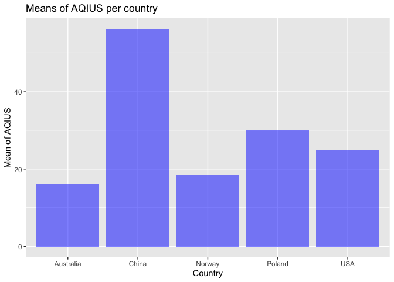
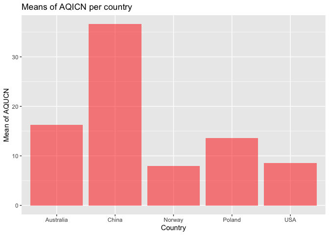
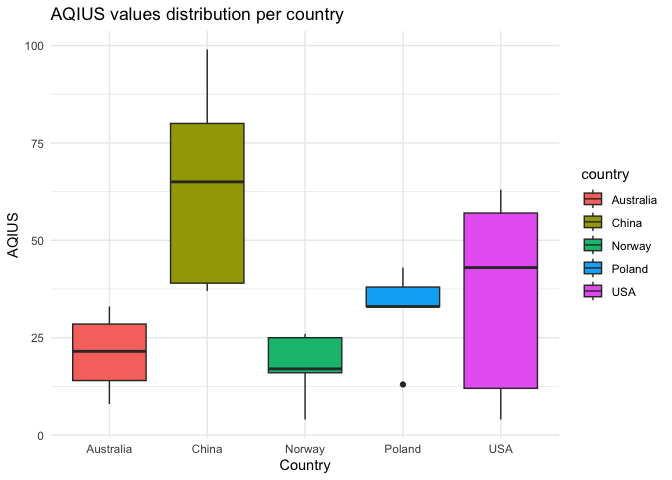
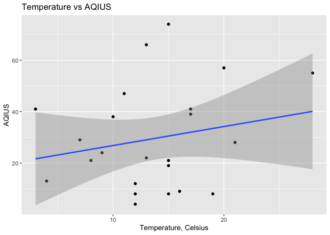
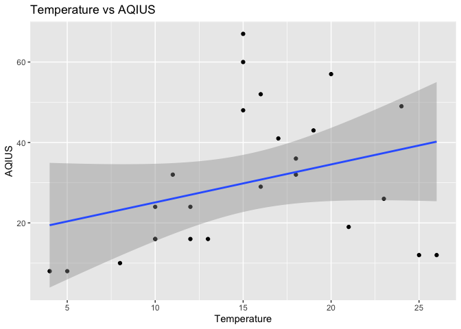
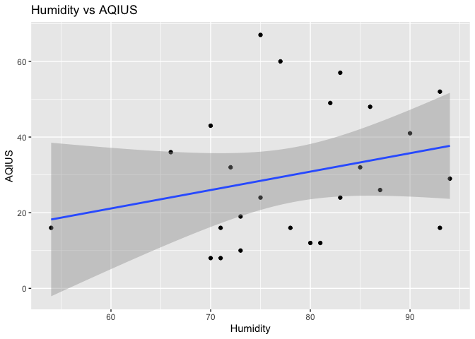
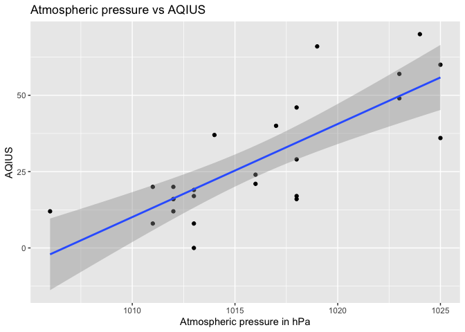
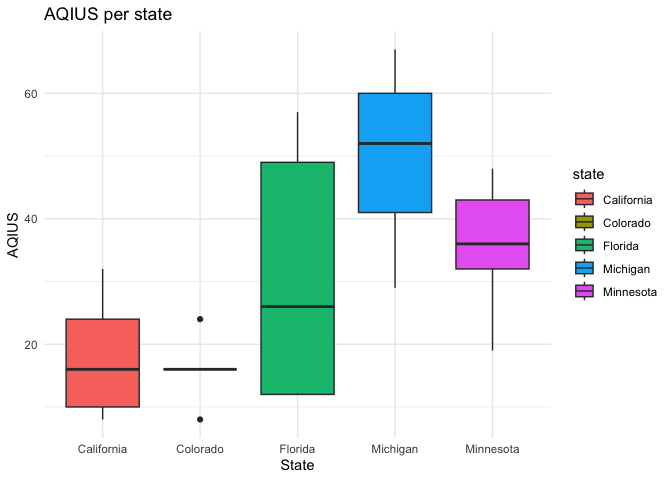

ST-558, Project 2
================
Nataliya Peshekhodko
2023-10-01

# Vignette for reading and summarizing data from an IQAir APIs

## Overall Goal

Vignettes are explanations of some concept, package, etc. with text,
code, and output interweaved. Our goal with this project is to create a
vignette about contacting an [IQAir
APIs](https://www.iqair.com/dashboard/api) using custom functions to
query, parse, and return well-structured data. IQAir APIs provide
information about **real time air quality data**. API endpoint used
<https://www.iqair.com/dashboard/api>

## Packages

Packages required to run code included in that analysis:

``` r
library(httr)
library(dplyr)
library(tibble)
library(jsonlite)
library(ggplot2)
library(RColorBrewer)
```

- `httr` - required for making HTTP requests
- `dplyr` - required for data manipulation
- `tibble` - required for formatting data frame
- `jsonlite` - required for converting JSON data from/to R objects
- `ggplot2` - required for creating graphs
- `RColorBrewer` - provides color schemes for maps

Define variable for API key required for the authentication during HTTP
request:

``` r
key = '97d5c2b8-7656-4974-827e-9d59486f7777'
```

## Functions for reading data from IQAir APIs

This section is dedicated for helper functions required for HTTP
requests.

### Get states function

Function to retrieve `states` based on the `country` name. States
returned as a list.

``` r
get_states <- function(country, api_key = key) {
  url = 'http://api.airvisual.com/v2/states'
  resp = GET(url, query = list(key = api_key, 
                               country = country))
  parsed = fromJSON(rawToChar(resp$content))
  
  return (as.list(parsed$data)$state)
}
```

### Get cities function

Function to get `cities` based on the provided `country` and `state`.
Cities returned as a list.

``` r
get_cities <- function(country, state, api_key = key) {
  url = 'http://api.airvisual.com/v2/cities'
  
  resp = GET(url, query = list(key = api_key, 
                               country = country,
                               state = state))
  parsed = fromJSON(rawToChar(resp$content))
  return (as.list(parsed$data)$city)
}
```

### Get air quality and weather metrics based on country, state and city

Function returns air quality based on the `country`, `state` and `city`.
If `city` is not provided, random sample of the size `sample_size` will
be chosen from the cities which belong to the `state`. If
`weather_metrics = TRUE` in addition to air quality metrics, weather
metrics like, temperature, humidity, wind speed and pressure will be
returned.

Functions returns data frame in `tibble` format with following columns:

- `country`
- `state`
- `city`
- `aqius` - AQI value based on US EPA standard
- `aqicn` - AQI value based on China MEP standard

If `weather_metrics = TRUE` in addition to the columns above, function
also returns:

- `temp_cels` - temperature in Celsius
- `humidity` - humidity %
- `wind_speed` - wind speed (m/s)
- `atm_pressure` - atmospheric pressure in hPa

``` r
get_air_quality_per_city <- function(country, 
                                     state, 
                                     city = NULL,
                                     weather_metrics = TRUE,
                                     sample_size = 5,
                                     api_key = key) {
  
  results = tibble()
  url = 'http://api.airvisual.com/v2/city'
 
  if (is.null(city)) {
    cities = get_cities(country, state)
  
    if (length(cities) > sample_size) {
      set.seed(123)
      cities = sample(cities, size = sample_size)
    }
    
    for (city in cities) {
      Sys.sleep(15) # required to avoid error - too many requests
      resp = GET(url, query = list(key = key, 
                                   country = country,
                                   state = state,
                                   city = city))
      parsed = fromJSON(rawToChar(resp$content))
      
      if (weather_metrics == TRUE) {
        subset_df = tibble(aqius = parsed$data$current$pollution$aqius, 
                           aqicn = parsed$data$current$pollution$aqicn, 
                           city = parsed$data$city,
                           state = parsed$data$state,
                           country = parsed$data$country,
                           temp_cels = parsed$data$current$weather$tp,
                           humidity = parsed$data$current$weather$hu, 
                           wind_speed = parsed$data$current$weather$ws,
                           atm_pressure = parsed$data$current$weather$pr)
      } else {
        subset_df = tibble(aqius = parsed$data$current$pollution$aqius, 
                           aqicn = parsed$data$current$pollution$aqicn, 
                           city = parsed$data$city,
                           state = parsed$data$state,
                           country = parsed$data$country)
      }
      results <- bind_rows(results, subset_df)
    
  }
    } else {
      resp = GET(url, query = list(key = key, 
                                   country = country,
                                   state = state,
                                   city = city))
      parsed = fromJSON(rawToChar(resp$content))
      if (weather_metrics == TRUE) {
        subset_df = tibble(aqius = parsed$data$current$pollution$aqius, 
                           aqicn = parsed$data$current$pollution$aqicn, 
                           city = parsed$data$city,
                           state = parsed$data$state,
                           country = parsed$data$country,
                           temp_cels = parsed$data$current$weather$tp,
                           humidity = parsed$data$current$weather$hu, 
                           wind_speed = parsed$data$current$weather$ws,
                           atm_pressure = parsed$data$current$weather$pr)
      } else {
        subset_df = tibble(aqius = parsed$data$current$pollution$aqius, 
                           aqicn = parsed$data$current$pollution$aqicn, 
                           city = parsed$data$city,
                           state = parsed$data$state,
                           country = parsed$data$country)
      }
      results <- bind_rows(results, subset_df)
  }
  return (results)
}
```

### Get air quality and weather metrics for country

Function returns air quality and weather metrics based on the country
name. Random sample of the size `sample_size` is thrown from from the
states which belongs to the country. For each state, random city is
selected and metrics returned.

Functions returns data frame in `tibble` format with following columns:

- `country`
- `state`
- `city`
- `aqius` - AQI value based on US EPA standard
- `aqicn` - AQI value based on China MEP standard
- `temp_cels` - temperature in Celsius
- `humidity` - humidity %
- `wind_speed` - wind speed (m/s)
- `atm_pressure` - atmospheric pressure in hPa

``` r
get_air_quality_per_country <- function(country, 
                                        weather_metrics = TRUE,
                                        sample_size = 5,
                                        api_key = key) {
  
  results = tibble()
  url = 'http://api.airvisual.com/v2/city'
  
  
  states = get_states(country, api_key = key)
  
  set.seed(2)
  states = sample(states, size = sample_size)
  
  
  for (state in states) {
    Sys.sleep(15) # required to avoid error - too many requests
    cities = get_cities(country, state, api_key = key)
    set.seed(4)
    city = sample(cities, size = 1)
    
    Sys.sleep(15) # required to avoid error - too many requests
    resp = GET(url, query = list(key = api_key, 
                                 country = country,
                                 state = state,
                                 city = city))
    parsed = fromJSON(rawToChar(resp$content))
    subset_df = tibble(aqius = parsed$data$current$pollution$aqius, 
                       aqicn = parsed$data$current$pollution$aqicn, 
                       city = parsed$data$city,
                       state = parsed$data$state,
                       country = parsed$data$country,
                       temp_cels = parsed$data$current$weather$tp,
                       humidity = parsed$data$current$weather$hu, 
                       wind_speed = parsed$data$current$weather$ws,
                       atm_pressure = parsed$data$current$weather$pr)
    results <- bind_rows(results, subset_df)
  }
  return (results)
}
```

## Exploratory Data Analysis

### EDA for countries

Let’s look at air pollution and weather metrics for different countries
across the globe. Chosen countries: China, USA, Poland, Australia,
Norway.

*Note: Sample size and set of countries chosen to be small due to API
limitations and time required to render the whole document*

``` r
sample = 5
air_usa = get_air_quality_per_country(country = 'USA', sample_size = sample)
air_china = get_air_quality_per_country(country = 'China', sample_size = sample)
air_poland = get_air_quality_per_country(country = 'Poland', sample_size = sample)
air_australia = get_air_quality_per_country(country = 'Australia', sample_size = sample)
air_norway = get_air_quality_per_country(country = 'Norway', sample_size = sample)
```

Combine all obtained data frames together in one data frame.

``` r
all = bind_rows(air_australia, air_poland, air_china, air_usa, air_norway)
```

Let’s look at data frame with combined records:

``` r
all
```

    ## # A tibble: 24 × 9
    ##    aqius aqicn city     state country temp_cels humidity wind_speed atm_pressure
    ##    <int> <int> <chr>    <chr> <chr>       <int>    <int>      <dbl>        <int>
    ##  1    28    31 West Fo… Vict… Austra…        21       38      10.3          1015
    ##  2     9    10 Scottsd… Tasm… Austra…        16       53       3.49         1017
    ##  3     8     3 Forrest  ACT   Austra…        19       60       3.09         1021
    ##  4    19    21 Joondal… West… Austra…        15       62       5.81         1013
    ##  5    21     7 Trzebni… Lowe… Poland         15       73       0.45         1023
    ##  6    21     7 Goldap   Warm… Poland          8       96       2.44         1021
    ##  7    38    13 Lukow    Lubl… Poland         10       75       2.93         1023
    ##  8    24    10 Wloszcz… Swie… Poland          9       66       1.93         1024
    ##  9    47    31 Warsaw   Mazo… Poland         11       81       1.54         1022
    ## 10    29    17 Yushu    Qing… China           7       80       0.75         1014
    ## # ℹ 14 more rows

Now, we need to create categorical variables for `aqius`, `aqicn` and
`humidity`.

If `aqius` value is less than **50**, the air quality is considered to
be `good`. If `aqius` value is greater or equal **50** and less or equal
**100**, the air quality is considered to be `moderate`. If `aquis`
value is greater than **100**, the air quality is considered
`unhealthy`.

If `aqicn` value is less than **50**, the air quality is considered to
be `excellent`, if `aqicn` value is greater or equal **50** and lees or
equal **100**, the air quality is considered to be `good`. If `aqicn`
value is greater than **100**, the air quality is considered `polluted`.

If `humidity` level is less or equal **40%**, it is considered `low`. If
`humidity` level is greater than **40%** and less than or equal to
**60%**, it is considered `normal`. If `humidity` is greater than
**60%**, it is considered `high`.

Creating new categorical variables based on the rules outlined above and
displaying updated data frame.

``` r
all <- all %>%
  mutate(aqius_category = case_when(
    aqius < 50 ~ "good",
    aqius >= 50 & aqius <= 100 ~ "moderate",
    aqius > 100 ~ "unhealthy"
  )) %>%
  mutate(aqicn_category = case_when(
    aqicn < 50 ~ "excellent",
    aqicn >= 50 & aqicn <= 100 ~ "good",
    aqicn > 100 ~ "polluted"
  )) %>%
  mutate(humidity_category = case_when(
    humidity <= 40 ~ 'low',
    humidity > 40 & humidity <= 60 ~ 'normal',
    humidity > 60 ~ 'high'
  ))
 all 
```

    ## # A tibble: 24 × 12
    ##    aqius aqicn city     state country temp_cels humidity wind_speed atm_pressure
    ##    <int> <int> <chr>    <chr> <chr>       <int>    <int>      <dbl>        <int>
    ##  1    28    31 West Fo… Vict… Austra…        21       38      10.3          1015
    ##  2     9    10 Scottsd… Tasm… Austra…        16       53       3.49         1017
    ##  3     8     3 Forrest  ACT   Austra…        19       60       3.09         1021
    ##  4    19    21 Joondal… West… Austra…        15       62       5.81         1013
    ##  5    21     7 Trzebni… Lowe… Poland         15       73       0.45         1023
    ##  6    21     7 Goldap   Warm… Poland          8       96       2.44         1021
    ##  7    38    13 Lukow    Lubl… Poland         10       75       2.93         1023
    ##  8    24    10 Wloszcz… Swie… Poland          9       66       1.93         1024
    ##  9    47    31 Warsaw   Mazo… Poland         11       81       1.54         1022
    ## 10    29    17 Yushu    Qing… China           7       80       0.75         1014
    ## # ℹ 14 more rows
    ## # ℹ 3 more variables: aqius_category <chr>, aqicn_category <chr>,
    ## #   humidity_category <chr>

*Note: in the following sections I will be doing EDA and results
interpretation. Given the data, I am retrieving every time I render
document, is real time data, it could be some discrepancies between
values and I my interpretation, but I will try my best to be consistent
with values and interpretation.*

Create 2-way contingency table for `aqius_category` vs `country`.

``` r
table(all$aqius_category, all$country)
```

    ##           
    ##            Australia China Norway Poland USA
    ##   good             4     1      5      5   5
    ##   moderate         0     4      0      0   0

As it could be seen from the table above, `China` has at least one city
with `unhealthy` air based on `aqius` values. All sampled cities for
`Australia` and `Norway` have `good` air quality.

Create 2-way contingency table for `aqicn_category` vs `country`.

``` r
table(all$aqicn_category, all$country)
```

    ##            
    ##             Australia China Norway Poland USA
    ##   excellent         4     3      5      5   5
    ##   good              0     2      0      0   0

Based on the `aqicn` values, all selected cities for all countries,
except `China` have `excellent` air quality.

Create 2-way contingency table for `aqius_category` vs
`humidity_category`.

``` r
table(all$aqius_category, all$humidity_category)
```

    ##           
    ##            high low normal
    ##   good       16   1      3
    ##   moderate    2   1      1

Create 2-way contingency table for `aqicn_category` vs
`humidity_category`.

``` r
table(all$aqicn_category, all$humidity_category)
```

    ##            
    ##             high low normal
    ##   excellent   18   1      3
    ##   good         0   1      1

Based on the two tables above, the most observations for the `excellent`
and `good` air quality are for the `high` humidity level.

Now, let’s group by `country` and calculate `aqius` mean, `aqicn` mean
and standard deviations for each group.

``` r
result <- all %>%
  group_by(country) %>%
  summarize(mean_aqius = mean(aqius), 
            mean_aqicn = mean(aqicn), 
            sd_aquis = sd(aqius),
            sd_aqicn = sd(aqicn)) 
result
```

    ## # A tibble: 5 × 5
    ##   country   mean_aqius mean_aqicn sd_aquis sd_aqicn
    ##   <chr>          <dbl>      <dbl>    <dbl>    <dbl>
    ## 1 Australia       16         16.2     9.42    12.3 
    ## 2 China           56.2       36.6    17.0     19.9 
    ## 3 Norway          18.4        8      14.2      6.71
    ## 4 Poland          30.2       13.6    11.7     10.0 
    ## 5 USA             24.8        8.6    16.1      5.32

Based on the values above, `China` has the highest values for `aqius`
and `aqicn`, while `Australia` has the lowest values for `aqius` and
`aqicn`.

Visualizing obtained results for `aqius`.

``` r
ggplot(result, aes(x = country, y = mean_aqius)) +
  geom_bar(stat = "identity", fill = "blue", alpha = 0.5) +
  labs(title = "Means of AQIUS per country", x = "Country", y = "Mean of AQIUS")
```

<!-- -->

Visualizing obtained results for `aqicn`.

``` r
ggplot(result, aes(x = country, y = mean_aqicn)) +
  geom_bar(stat = "identity", fill = "red", alpha = 0.5) +
  labs(title = "Means of AQICN per country", x = "Country", y = "Mean of AQUCN")
```

<!-- -->

The graphs above shows means for the `aqius` and `aqicn`. `China` has
the highest values for `aqius` and `aqicn`, while `Australia` has the
lowest values for `aqius` and `aqicn`.

Let’s look at `aqius` distribution for each country. Creating box plot
for `aqius` per `country`.

``` r
ggplot(all, aes(x = country, y = aqius, fill = country)) +
  geom_boxplot() +
  labs(title = "AQIUS values distribution per country", x = "Country", y = "AQIUS") +
  theme_minimal()
```

<!-- --> Creating
heatmap for numerical variables

``` r
data <- as.matrix(all %>% select(aqius, aqicn, temp_cels, humidity, wind_speed, atm_pressure))
heatmap(data,
        Rowv=NA,
        Colv=NA, 
        labCol=colnames(data), 
        col= colorRampPalette(brewer.pal(8, "Oranges"))(25), 
        scale="column",
        main="Heatmap for numerical variables")
legend(x="bottomright", legend=c("min", "ave", "max"), 
     fill=colorRampPalette(brewer.pal(8, "Oranges"))(3))
```

<!-- -->

Let’s looks at correlation matrix for all numerical variables.

``` r
cor(data)
```

    ##                    aqius      aqicn   temp_cels    humidity  wind_speed
    ## aqius         1.00000000  0.8533782  0.21514732 -0.24824007 -0.06529375
    ## aqicn         0.85337824  1.0000000  0.16024627 -0.54899109  0.21240707
    ## temp_cels     0.21514732  0.1602463  1.00000000 -0.28016648  0.40009458
    ## humidity     -0.24824007 -0.5489911 -0.28016648  1.00000000 -0.56450843
    ## wind_speed   -0.06529375  0.2124071  0.40009458 -0.56450843  1.00000000
    ## atm_pressure -0.11770261 -0.2369584  0.07239776 -0.04265217 -0.07745534
    ##              atm_pressure
    ## aqius         -0.11770261
    ## aqicn         -0.23695837
    ## temp_cels      0.07239776
    ## humidity      -0.04265217
    ## wind_speed    -0.07745534
    ## atm_pressure   1.00000000

From the matrix above, it could be seen that there are some positive
linear correlation between `aqius` and `atm_pressure`, `aqius` and
`temp_cels`, `aqicn` and `temp_cels`, `aqicn` and `atm_pressure`. There
are some negative linear correlation between `aqius` and `wind_speed`,
`aqicn` and `humidity`, `aqicn` and `wind_speed`.

Let’s check if there are any linear dependency between current
temperature and observed `aquis` values.

``` r
ggplot(all, aes(x = temp_cels, y = aqius)) +
  geom_point() +          
  geom_smooth(method = "lm",
              formula = y ~ x,
              se = TRUE) +
  labs(title = "Temperature vs AQIUS",
       x = "Temperature, Celsius",
       y = "AQIUS")  
```

<!-- -->

As, it could be seen from the graph above, there are might be some
relationship between temperature and observed `aquis` values. The higher
the temperature, the higher the `aquis` values.

### EDA for the US states

Now, let’s look at several states across `USA` and compare air quality.
Chosen states: *California*, *Colorado*, *Minnesota*, *Florida* and
*Michigan*. Sample size for each state is equal to `5`.

Reading data for each state using function `get_air_quality_per_city`:

``` r
sample = 5
air_california = get_air_quality_per_city(country = 'USA', state = 'California', sample_size = sample)
air_colorado = get_air_quality_per_city(country = 'USA', state = 'Colorado', sample_size = sample)
air_minnesota = get_air_quality_per_city(country = 'USA', state = 'Minnesota', sample_size = sample)
air_florida = get_air_quality_per_city(country = 'USA', state = 'Florida', sample_size = sample)
air_michigan = get_air_quality_per_city(country = 'USA', state = 'Michigan', sample_size = sample)
```

Combine results in one data frame:

``` r
all_per_state = bind_rows(air_michigan, air_florida, air_minnesota, air_colorado, air_california)
all_per_state
```

    ## # A tibble: 25 × 9
    ##    aqius aqicn city     state country temp_cels humidity wind_speed atm_pressure
    ##    <int> <int> <chr>    <chr> <chr>       <int>    <int>      <dbl>        <int>
    ##  1    57    21 Harbor … Mich… USA            17       92       2.57         1023
    ##  2    36    12 Whiteha… Mich… USA            18       86       0.89         1025
    ##  3    70    30 Milford  Mich… USA            17       91       1.51         1024
    ##  4    60    24 Caro     Mich… USA            17       82       0            1025
    ##  5    49    17 Rogers … Mich… USA            18       91       2.06         1023
    ##  6    19    11 Miami    Flor… USA            26       90       2.24         1013
    ##  7    17     6 Royal P… Flor… USA            26       87       5.66         1013
    ##  8    29    10 Crystal… Flor… USA            24       79       4.12         1018
    ##  9    17     6 Pace     Flor… USA            24       60       3.6          1018
    ## 10    21     7 Rivervi… Flor… USA            25       85       8.23         1016
    ## # ℹ 15 more rows

Now, let’s use the same rules as outlined above, to create categorical
variables `aqius_category`, `aqicn_category` and `humidity_category` and
display updated data frame.

``` r
all_per_state <- all_per_state %>%
  mutate(aqius_category = case_when(
    aqius < 50 ~ "good",
    aqius >= 50 & aqius <= 100 ~ "moderate",
    aqius > 100 ~ "unhealthy"
  )) %>%
  mutate(aqicn_category = case_when(
    aqius < 50 ~ "excellent",
    aqius >= 50 & aqius <= 100 ~ "good",
    aqius > 100 ~ "polluted"
  )) %>%
  mutate(humidity_category = case_when(
    humidity <= 40 ~ 'low',
    humidity > 40 & humidity <= 60 ~ 'normal',
    humidity > 60 ~ 'high'
  ))
all_per_state 
```

    ## # A tibble: 25 × 12
    ##    aqius aqicn city     state country temp_cels humidity wind_speed atm_pressure
    ##    <int> <int> <chr>    <chr> <chr>       <int>    <int>      <dbl>        <int>
    ##  1    57    21 Harbor … Mich… USA            17       92       2.57         1023
    ##  2    36    12 Whiteha… Mich… USA            18       86       0.89         1025
    ##  3    70    30 Milford  Mich… USA            17       91       1.51         1024
    ##  4    60    24 Caro     Mich… USA            17       82       0            1025
    ##  5    49    17 Rogers … Mich… USA            18       91       2.06         1023
    ##  6    19    11 Miami    Flor… USA            26       90       2.24         1013
    ##  7    17     6 Royal P… Flor… USA            26       87       5.66         1013
    ##  8    29    10 Crystal… Flor… USA            24       79       4.12         1018
    ##  9    17     6 Pace     Flor… USA            24       60       3.6          1018
    ## 10    21     7 Rivervi… Flor… USA            25       85       8.23         1016
    ## # ℹ 15 more rows
    ## # ℹ 3 more variables: aqius_category <chr>, aqicn_category <chr>,
    ## #   humidity_category <chr>

Create 2-way contingency table for `aqius_category` vs `state`.

``` r
table(all_per_state$aqius_category, all_per_state$state)
```

    ##           
    ##            California Colorado Florida Michigan Minnesota
    ##   good              5        5       5        2         4
    ##   moderate          0        0       0        3         1

Based on the table above, Michigan has 4 states out of 5 with `moderate`
air quality. California, Colorado and Florida have all 5 cities with
`good` air quality.

Create 2-way contingency table for `aqicn_category` vs `state`.

``` r
table(all_per_state$aqicn_category, all_per_state$state)
```

    ##            
    ##             California Colorado Florida Michigan Minnesota
    ##   excellent          5        5       5        2         4
    ##   good               0        0       0        3         1

Based on the table above, Michigan has 4 states out of 5 with `good` air
quality.

Create 2-way contingency table for `aqius_category` vs
`humidity_category`.

``` r
table(all_per_state$aqius_category, all_per_state$humidity_category)
```

    ##           
    ##            high low normal
    ##   good       10   5      6
    ##   moderate    4   0      0

Most of the observations with `good` air quality are from observations
with `high` humidity.

Create 2-way contingency table for `aqicn_category` vs
`humidity_category`.

``` r
table(all_per_state$aqicn_category, all_per_state$humidity_category)
```

    ##            
    ##             high low normal
    ##   excellent   10   5      6
    ##   good         4   0      0

Most of the observations with `exellent` air quality are from
observations with `high` humidity.

Let’s looks at correlation matrix for all numerical variables.

``` r
data <- as.matrix(all_per_state %>% select(aqius, aqicn, temp_cels, humidity, wind_speed, atm_pressure))
cor(data)
```

    ##                   aqius      aqicn  temp_cels   humidity wind_speed
    ## aqius         1.0000000  0.9213696 -0.4500791  0.7134753 -0.5816052
    ## aqicn         0.9213696  1.0000000 -0.3682758  0.6523935 -0.5157466
    ## temp_cels    -0.4500791 -0.3682758  1.0000000 -0.2194810  0.6095188
    ## humidity      0.7134753  0.6523935 -0.2194810  1.0000000 -0.3068611
    ## wind_speed   -0.5816052 -0.5157466  0.6095188 -0.3068611  1.0000000
    ## atm_pressure  0.7825955  0.6379802 -0.3907240  0.6253182 -0.5996831
    ##              atm_pressure
    ## aqius           0.7825955
    ## aqicn           0.6379802
    ## temp_cels      -0.3907240
    ## humidity        0.6253182
    ## wind_speed     -0.5996831
    ## atm_pressure    1.0000000

From the matrix above, it could be seen that there are some positive
linear correlation between `aqius` and `atm_pressure`, `aqius` and
`temp_cels`, `aqius` and `humidity`, `aqicn` and `temp_cels`, `aqicn`
and `atm_pressure`, `aqicn` and `humidity`. There are some negative
linear correlation between `aqius` and `wind_speed`, `aqicn` and
`wind_speed`.

Now, let’s group by `state` and calculate `aqius` mean, `aqicn` mean and
standard deviations for each group.

``` r
result <- all_per_state %>%
  group_by(state) %>%
  summarize(mean_aqius = mean(aqius), 
            mean_aqicn = mean(aqicn), 
            sd_aquis = sd(aqius),
            sd_aqicn = sd(aqicn)) 
result
```

    ## # A tibble: 5 × 5
    ##   state      mean_aqius mean_aqicn sd_aquis sd_aqicn
    ##   <chr>           <dbl>      <dbl>    <dbl>    <dbl>
    ## 1 California       16.8        7.6     3.35     3.78
    ## 2 Colorado          8.8        3.2     5.93     2.17
    ## 3 Florida          20.6        8       4.98     2.35
    ## 4 Michigan         54.4       20.8    12.7      6.83
    ## 5 Minnesota        42.6       18.4    15.4      8.38

Let’s check if there are any linear dependency between wind speed and
observed `aquis` values.

``` r
ggplot(all_per_state, aes(x = wind_speed, y = aqius)) +
  geom_point() +                 
  geom_smooth(method = "lm", 
              formula = y ~ x,
              se = TRUE) + 
  labs(title = "Temperature vs AQIUS", 
       x = "Wind speed",
       y = "AQIUS")  
```

<!-- -->

As it could be seen from the graph, the stronger the wind, the lower the
`aqius` values.

Let’s check if there are any linear dependency between temperature and
observed `aquis` values.

``` r
ggplot(all_per_state, aes(x = temp_cels, y = aqius)) +
  geom_point() + 
  geom_smooth(method = "lm", 
              formula = y ~ x,
              se = TRUE) + 
  labs(title = "Temperature vs AQIUS", 
       x = "Temperature", 
       y = "AQIUS")  
```

<!-- -->

As it could be seen from the graph above, the higher the temperature,
the higher `aqius` values.

Let’s check if there are any linear dependency between humidity level
and observed `aquis` values.

``` r
ggplot(all_per_state, aes(x = humidity, y = aqius)) +
  geom_point() + 
  geom_smooth(method = "lm",
              formula = y ~ x, 
              se = TRUE) + 
  labs(title = "Humidity vs AQIUS", 
       x = "Humidity",
       y = "AQIUS") 
```

<!-- -->

As it could be seen from the graph above, there is may be some linear
relationship between humidity levels and `aqius` values. The higher the
humidity, the higher the `aquis` values.

Let’s check if there are any linear dependency between atmospheric
pressure and observed `aquis` values.

``` r
ggplot(all_per_state, aes(x = atm_pressure, y = aqius)) +
  geom_point() + 
  geom_smooth(method = "lm",
              formula = y ~ x, 
              se = TRUE) + 
  labs(title = "Atmospheric pressure vs AQIUS", 
       x = "Atmospheric pressure in hPa",
       y = "AQIUS") 
```

<!-- -->

As it could be seen from the graph above, the higher the atmospheric
pressure, the higher the `aqius`.

Let’s look at `aqius` distribution for each `state`. Creating box plot
for `aqius` per `state`.

``` r
ggplot(all_per_state, aes(x = state, y = aqius, fill = state)) +
  geom_boxplot() +
  labs(title = "AQIUS per state", x = "State", y = "AQIUS") +
  theme_minimal()
```

<!-- -->

## Summary

At this project we created functions to query **IQAir APIs** to retrieve
data quality and weather metrics per country, state and city. Due to
free account limitations, small samples were derived for several
countries across the globe and several states across the United States.
For both data frames EDA was conducted. The EDA showed that:

- there are negative linear correlation between wind speed and air
  quality
- air quality is better when humidity level is high
- air quality is deacresing when atmospheric pressure is increasing.
