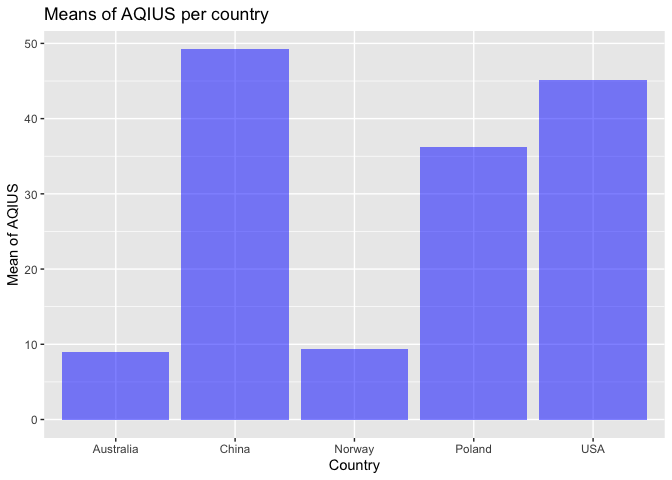
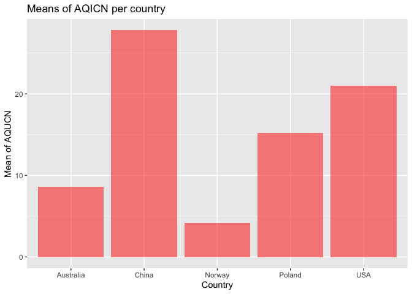
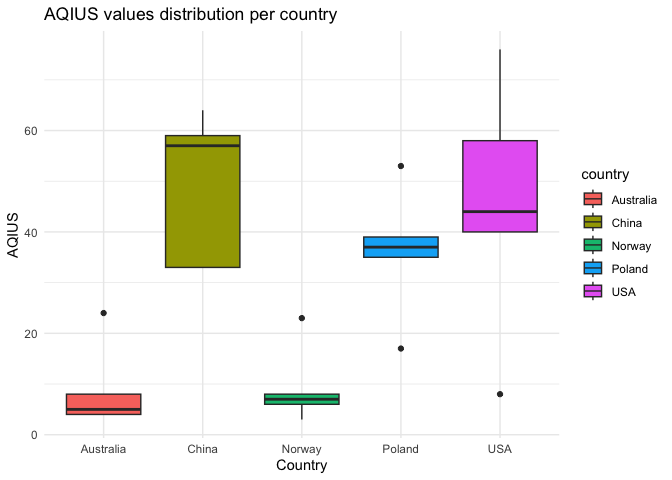
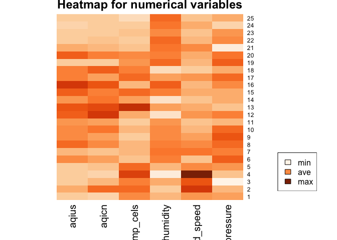
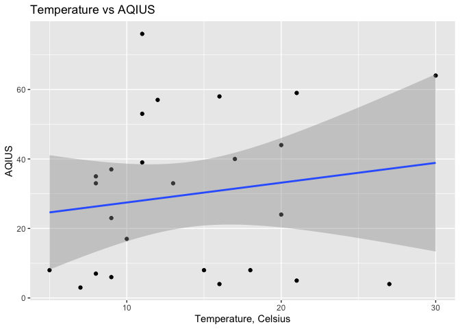
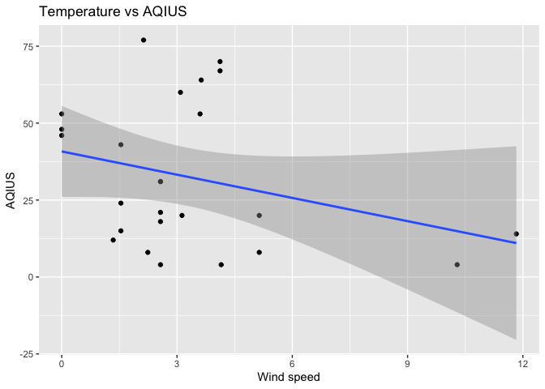
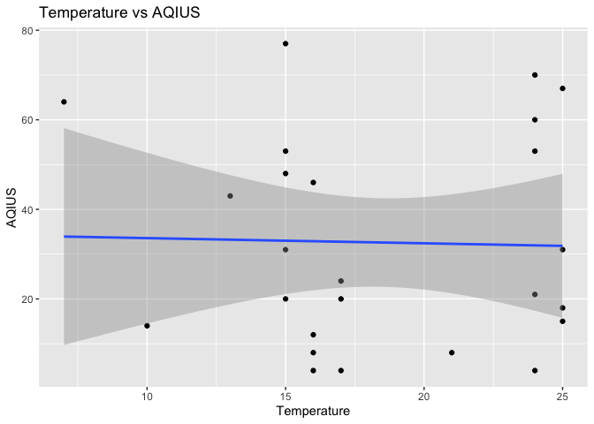
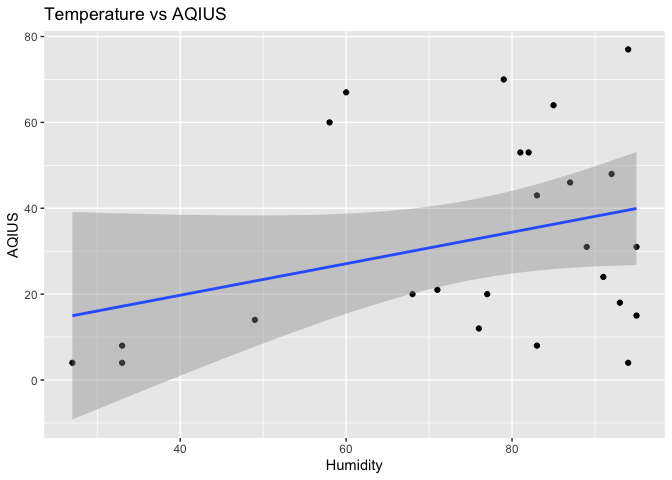
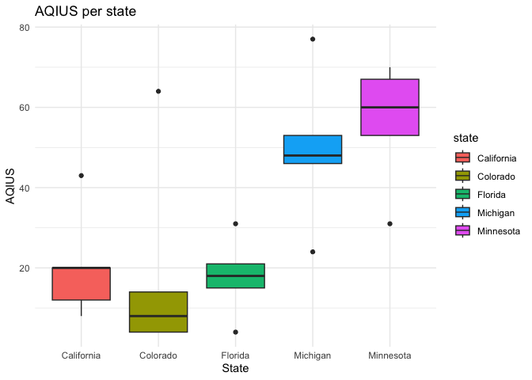

ST-558, Project 2
================
Nataliya Peshekhodko
2023-09-30

- <a
  href="#1-vignette-for-reading-and-summarizing-data-from-an-iqair-apis"
  id="toc-1-vignette-for-reading-and-summarizing-data-from-an-iqair-apis">1
  Vignette for reading and summarizing data from an IQAir APIs</a>
  - <a href="#11-overall-goal" id="toc-11-overall-goal">1.1 Overall Goal</a>
  - <a href="#12-packages" id="toc-12-packages">1.2 Packages</a>
  - <a href="#13-functions-for-reading-data-from-iqair-apis"
    id="toc-13-functions-for-reading-data-from-iqair-apis">1.3 Functions for
    reading data from IQAir APIs</a>
  - <a href="#14-exploratory-data-analysis"
    id="toc-14-exploratory-data-analysis">1.4 Exploratory Data Analysis</a>
    - <a href="#141-eda-for-countries" id="toc-141-eda-for-countries">1.4.1
      EDA for countries</a>
    - <a href="#142-eda-for-the-us-states"
      id="toc-142-eda-for-the-us-states">1.4.2 EDA for the US states</a>

# 1 Vignette for reading and summarizing data from an IQAir APIs

## 1.1 Overall Goal

Vignettes are explanations of some concept, package, etc. with text,
code, and output interweaved. Our goal with this project is to create a
vignette about contacting an [IQAir
APIs](https://www.iqair.com/dashboard/api) using custom functions to
query, parse, and return well-structured data. IQAir APIs provide
information about **real time air quality data**. API endpoint used
<https://www.iqair.com/dashboard/api>

## 1.2 Packages

Packages required to run code included in that analysis:

``` r
library(httr)
library(dplyr)
library(tibble)
library(jsonlite)
library(ggplot2)
library(RColorBrewer)
```

- `httr` - required for making HTTP requests
- `dplyr` - required for data manipulation
- `tibble` - required for formatting data frame
- `jsonlite` - required for converting JSON data from/to R objects
- `ggplot2` - required for creating graphs
- `RColorBrewer` - provides color schemes for maps

Define variable for API key required for the authentication during HTTP
request:

``` r
key = '97d5c2b8-7656-4974-827e-9d59486f7777'
```

## 1.3 Functions for reading data from IQAir APIs

This section is dedicated for helper functions required for HTTP
requests.

Function to retrieve `states` based on the `country` name. States
returned as a list.

``` r
get_states <- function(country, api_key = key) {
  url = 'http://api.airvisual.com/v2/states'
  resp = GET(url, query = list(key = api_key, 
                               country = country))
  parsed = fromJSON(rawToChar(resp$content))
  
  return (as.list(parsed$data)$state)
}
```

Function to get `cities` based on the provided `country` and `state`.
Cities returned as a list.

``` r
get_cities <- function(country, state, api_key = key) {
  url = 'http://api.airvisual.com/v2/cities'
  
  resp = GET(url, query = list(key = api_key, 
                               country = country,
                               state = state))
  parsed = fromJSON(rawToChar(resp$content))
  return (as.list(parsed$data)$city)
}
```

Function returns air quality based on the `country`, `state` and `city`.
If `city` is not provided, random sample of the size `sample_size` will
be chosen from the cities which belong to the `state`. If
`weather_metrics = TRUE` in addition to air quality metrics, weather
metrics like, temperature, humidity, wind speed and pressure will be
returned.

Functions returns data frame in `tibble` format with following columns:

- `country`
- `state`
- `city`
- `aqius` - AQI value based on US EPA standard
- `aqicn` - AQI value based on China MEP standard

If `weather_metrics = TRUE` in addition to the columns above, function
also returns:

- `temp_cels` - temperature in Celsius
- `humidity` - humidity %
- `wind_speed` - wind speed (m/s)
- `atm_pressure` - atmospheric pressure in hPa

``` r
get_air_quality_per_city <- function(country, 
                                     state, 
                                     city = NULL,
                                     weather_metrics = TRUE,
                                     sample_size = 5,
                                     api_key = key) {
  
  results = tibble()
  url = 'http://api.airvisual.com/v2/city'
 
  if (is.null(city)) {
    cities = get_cities(country, state)
  
    if (length(cities) > sample_size) {
      set.seed(123)
      cities = sample(cities, size = sample_size)
    }
    
    for (city in cities) {
      Sys.sleep(15) # required to avoid error - too many requests
      resp = GET(url, query = list(key = key, 
                                   country = country,
                                   state = state,
                                   city = city))
      parsed = fromJSON(rawToChar(resp$content))
      
      if (weather_metrics == TRUE) {
        subset_df = tibble(aqius = parsed$data$current$pollution$aqius, 
                           aqicn = parsed$data$current$pollution$aqicn, 
                           city = parsed$data$city,
                           state = parsed$data$state,
                           country = parsed$data$country,
                           temp_cels = parsed$data$current$weather$tp,
                           humidity = parsed$data$current$weather$hu, 
                           wind_speed = parsed$data$current$weather$ws,
                           atm_pressure = parsed$data$current$weather$pr)
      } else {
        subset_df = tibble(aqius = parsed$data$current$pollution$aqius, 
                           aqicn = parsed$data$current$pollution$aqicn, 
                           city = parsed$data$city,
                           state = parsed$data$state,
                           country = parsed$data$country)
      }
      results <- bind_rows(results, subset_df)
    
  }
    } else {
      resp = GET(url, query = list(key = key, 
                                   country = country,
                                   state = state,
                                   city = city))
      parsed = fromJSON(rawToChar(resp$content))
      if (weather_metrics == TRUE) {
        subset_df = tibble(aqius = parsed$data$current$pollution$aqius, 
                           aqicn = parsed$data$current$pollution$aqicn, 
                           city = parsed$data$city,
                           state = parsed$data$state,
                           country = parsed$data$country,
                           temp_cels = parsed$data$current$weather$tp,
                           humidity = parsed$data$current$weather$hu, 
                           wind_speed = parsed$data$current$weather$ws,
                           atm_pressure = parsed$data$current$weather$pr)
      } else {
        subset_df = tibble(aqius = parsed$data$current$pollution$aqius, 
                           aqicn = parsed$data$current$pollution$aqicn, 
                           city = parsed$data$city,
                           state = parsed$data$state,
                           country = parsed$data$country)
      }
      results <- bind_rows(results, subset_df)
  }
  return (results)
}
```

Function returns air quality and weather metrics based on the country
name. Random sample of the size `sample_size` is thrown from from the
states which belongs to the country. For each state, random city is
selected and metrics returned.

Functions returns data frame in `tibble` format with following columns:

- `country`
- `state`
- `city`
- `aqius` - AQI value based on US EPA standard
- `aqicn` - AQI value based on China MEP standard
- `temp_cels` - temperature in Celsius
- `humidity` - humidity %
- `wind_speed` - wind speed (m/s)
- `atm_pressure` - atmospheric pressure in hPa

``` r
get_air_quality_per_country <- function(country, 
                                        weather_metrics = TRUE,
                                        sample_size = 5,
                                        api_key = key) {
  
  results = tibble()
  url = 'http://api.airvisual.com/v2/city'
  
  
  states = get_states(country, api_key = key)
  
  set.seed(2)
  states = sample(states, size = sample_size)
  
  
  for (state in states) {
    Sys.sleep(15) # required to avoid error - too many requests
    cities = get_cities(country, state, api_key = key)
    set.seed(4)
    city = sample(cities, size = 1)
    
    Sys.sleep(15) # required to avoid error - too many requests
    resp = GET(url, query = list(key = api_key, 
                                 country = country,
                                 state = state,
                                 city = city))
    parsed = fromJSON(rawToChar(resp$content))
    subset_df = tibble(aqius = parsed$data$current$pollution$aqius, 
                       aqicn = parsed$data$current$pollution$aqicn, 
                       city = parsed$data$city,
                       state = parsed$data$state,
                       country = parsed$data$country,
                       temp_cels = parsed$data$current$weather$tp,
                       humidity = parsed$data$current$weather$hu, 
                       wind_speed = parsed$data$current$weather$ws,
                       atm_pressure = parsed$data$current$weather$pr)
    results <- bind_rows(results, subset_df)
  }
  return (results)
}
```

## 1.4 Exploratory Data Analysis

### 1.4.1 EDA for countries

Let’s look at air pollution and weather metrics for different countries
across the globe. Chosen countries: China, USA, Poland, Australia,
Norway.

*Note: Sample size and set of countries chosen to be small due to API
limitations and time required to render the whole document*

``` r
sample = 5
air_usa = get_air_quality_per_country(country = 'USA', sample_size = sample)
air_china = get_air_quality_per_country(country = 'China', sample_size = sample)
air_poland = get_air_quality_per_country(country = 'Poland', sample_size = sample)
air_australia = get_air_quality_per_country(country = 'Australia', sample_size = sample)
air_norway = get_air_quality_per_country(country = 'Norway', sample_size = sample)
```

Combine all obtained data frames together in one data frame.

``` r
all = bind_rows(air_australia, air_poland, air_china, air_usa, air_norway)
```

Let’s look at data frame with combined records:

``` r
all
```

    ## # A tibble: 25 × 9
    ##    aqius aqicn city           state             country   temp_cels humidity wind_speed atm_pressure
    ##    <int> <int> <chr>          <chr>             <chr>         <int>    <int>      <dbl>        <int>
    ##  1     4     1 Mount Barker   South Australia   Australia        16       60       3.1          1015
    ##  2    24    27 West Footscray Victoria          Australia        20       47       8.75         1012
    ##  3     8     8 Scottsdale     Tasmania          Australia        18       62       7.37          999
    ##  4     4     1 Forrest        ACT               Australia        27       22      11.8          1010
    ##  5     5     6 Geraldton      Western Australia Australia        21       60       4.12         1017
    ##  6    37    13 Trzebnica      Lower Silesia     Poland            9       86       0.89         1024
    ##  7    17     6 Goldap         Warmia-Masuria    Poland           10       92       5.04         1019
    ##  8    53    20 Lublin         Lublin            Poland           11       85       3.6          1022
    ##  9    35    13 Wloszczowa     Swietokrzyskie    Poland            8       81       2.65         1025
    ## 10    39    24 Warsaw         Mazovia           Poland           11       78       1.54         1022
    ## # ℹ 15 more rows

Now, we need to create categorical variables for `aqius`, `aqicn` and
`humidity`.

If `aqius` value is less than **50**, the air quality is considered to
be `good`. If `aqius` value is greater or equal **50** and less or equal
**100**, the air quality is considered to be `moderate`. If `aquis`
value is greater than **100**, the air quality is considered
`unhealthy`.

If `aqicn` value is less than **50**, the air quality is considered to
be `excellent`, if `aqicn` value is greater or equal **50** and lees or
equal **100**, the air quality is considered to be `good`. If `aqicn`
value is greater than **100**, the air quality is considered `polluted`.

If `humidity` level is less or equal **40%**, it is considered `low`. If
`humidity` level is greater than **40%** and less than or equal to
**60%**, it is considered `normal`. If `humidity` is greater than
**60%**, it is considered `high`.

Creating new categorical variables based on the rules outlined above and
displaying updated data frame.

``` r
all <- all %>%
  mutate(aqius_category = case_when(
    aqius < 50 ~ "good",
    aqius >= 50 & aqius <= 100 ~ "moderate",
    aqius > 100 ~ "unhealthy"
  )) %>%
  mutate(aqicn_category = case_when(
    aqicn < 50 ~ "excellent",
    aqicn >= 50 & aqicn <= 100 ~ "good",
    aqicn > 100 ~ "polluted"
  )) %>%
  mutate(humidity_category = case_when(
    humidity <= 40 ~ 'low',
    humidity > 40 & humidity <= 60 ~ 'normal',
    humidity > 60 ~ 'high'
  ))
 all 
```

    ## # A tibble: 25 × 12
    ##    aqius aqicn city         state country temp_cels humidity wind_speed atm_pressure aqius_category aqicn_category humidity_category
    ##    <int> <int> <chr>        <chr> <chr>       <int>    <int>      <dbl>        <int> <chr>          <chr>          <chr>            
    ##  1     4     1 Mount Barker Sout… Austra…        16       60       3.1          1015 good           excellent      normal           
    ##  2    24    27 West Footsc… Vict… Austra…        20       47       8.75         1012 good           excellent      normal           
    ##  3     8     8 Scottsdale   Tasm… Austra…        18       62       7.37          999 good           excellent      high             
    ##  4     4     1 Forrest      ACT   Austra…        27       22      11.8          1010 good           excellent      low              
    ##  5     5     6 Geraldton    West… Austra…        21       60       4.12         1017 good           excellent      normal           
    ##  6    37    13 Trzebnica    Lowe… Poland          9       86       0.89         1024 good           excellent      high             
    ##  7    17     6 Goldap       Warm… Poland         10       92       5.04         1019 good           excellent      high             
    ##  8    53    20 Lublin       Lubl… Poland         11       85       3.6          1022 moderate       excellent      high             
    ##  9    35    13 Wloszczowa   Swie… Poland          8       81       2.65         1025 good           excellent      high             
    ## 10    39    24 Warsaw       Mazo… Poland         11       78       1.54         1022 good           excellent      high             
    ## # ℹ 15 more rows

*Note: in the following sections I will be doing EDA and results
interpretation. Given the data, I am retrieving every time I render
document, is real time data, it could be some discrepancies between
values and I my interpretation, but I will try my best to be consistent
with values and interpretation.*

Create 2-way contingency table for `aqius_category` vs `country`.

``` r
table(all$aqius_category, all$country)
```

    ##           
    ##            Australia China Norway Poland USA
    ##   good             5     2      5      4   3
    ##   moderate         0     3      0      1   2

As it could be seen from the table above, `China` has at least one city
with `unhealthy` air based on `aqius` values. All sampled cities for
`Australia` and `Norway` have `good` air quality.

Create 2-way contingency table for `aqicn_category` vs `country`.

``` r
table(all$aqicn_category, all$country)
```

    ##            
    ##             Australia China Norway Poland USA
    ##   excellent         5     5      5      5   5

Based on the `aqicn` values, all selected cities for all countries,
except `China` have `excellent` air quality.

Create 2-way contingency table for `aqius_category` vs
`humidity_category`.

``` r
table(all$aqius_category, all$humidity_category)
```

    ##           
    ##            high low normal
    ##   good       13   3      3
    ##   moderate    5   1      0

Create 2-way contingency table for `aqicn_category` vs
`humidity_category`.

``` r
table(all$aqicn_category, all$humidity_category)
```

    ##            
    ##             high low normal
    ##   excellent   18   4      3

Based on the two tables above, the most observations for the `excellent`
and `good` air quality are for the `high` humidity level.

Now, let’s group by `country` and calculate `aqius` mean and `aqicn`
mean for each group.

``` r
result <- all %>%
  group_by(country) %>%
  summarize(mean_aqius = mean(aqius), 
            mean_aqicn = mean(aqicn), 
            sd_aquis = sd(aqius),
            sd_aqicn = sd(aqicn)) 
result
```

    ## # A tibble: 5 × 5
    ##   country   mean_aqius mean_aqicn sd_aquis sd_aqicn
    ##   <chr>          <dbl>      <dbl>    <dbl>    <dbl>
    ## 1 Australia        9          8.6     8.54    10.7 
    ## 2 China           49.2       27.8    15.0     11.5 
    ## 3 Norway           9.4        4.2     7.83     2.95
    ## 4 Poland          36.2       15.2    12.9      6.98
    ## 5 USA             45.2       21      25.1     12.5

Based on the values above, `China` has the highest values for `aqius`
and `aqicn`, while `Australia` has the lowest values for `aqius` and
`aqicn`.

Visualizing obtained results for `aqius`.

``` r
ggplot(result, aes(x = country, y = mean_aqius)) +
  geom_bar(stat = "identity", fill = "blue", alpha = 0.5) +
  labs(title = "Means of AQIUS per country", x = "Country", y = "Mean of AQIUS")
```

<!-- -->

Visualizing obtained results for `aqicn`.

``` r
ggplot(result, aes(x = country, y = mean_aqicn)) +
  geom_bar(stat = "identity", fill = "red", alpha = 0.5) +
  labs(title = "Means of AQICN per country", x = "Country", y = "Mean of AQUCN")
```

<!-- -->

The graphs above shows means for the `aqius` and `aqicn`. `China` has
the highest values for `aqius` and `aqicn`, while `Australia` has the
lowest values for `aqius` and `aqicn`.

Let’s look at `aqius` distribution for each country. Creating box plot
for `aqius` per `country`.

``` r
ggplot(all, aes(x = country, y = aqius, fill = country)) +
  geom_boxplot() +
  labs(title = "AQIUS values distribution per country", x = "Country", y = "AQIUS") +
  theme_minimal()
```

<!-- --> Creating
heatmap for numerical variables

``` r
data <- as.matrix(all %>% select(aqius, aqicn, temp_cels, humidity, wind_speed, atm_pressure))
heatmap(data,
        Rowv=NA,
        Colv=NA, 
        labCol=colnames(data), 
        col= colorRampPalette(brewer.pal(8, "Oranges"))(25), 
        scale="column",
        main="Heatmap for numerical variables")
legend(x="bottomright", legend=c("min", "ave", "max"), 
     fill=colorRampPalette(brewer.pal(8, "Oranges"))(3))
```

<!-- --> Let’s check
if there are any linear dependency between current temperature and
observed `aquis` values.

``` r
ggplot(all, aes(x = temp_cels, y = aqius)) +
  geom_point() +          
  geom_smooth(method = "lm",
              formula = y ~ x,
              se = TRUE) +
  labs(title = "Temperature vs AQIUS",
       x = "Temperature, Celsius",
       y = "AQIUS")  
```

<!-- -->

As, it could be seen from the graph above, there are might be some
relationship between temperature and observed `aquis` values. The higher
the temperature, the higher the `aquis` values.

### 1.4.2 EDA for the US states

Now, let’s look at several states across `USA` and compare air quality.
Chosen states: California, Colorado, Minnesota, Florida and Michigan.
Sample size for each state is equal to `5`.

Reading data for each state using function `get_air_quality_per_city`:

``` r
sample = 5
air_california = get_air_quality_per_city(country = 'USA', state = 'California', sample_size = sample)
air_colorado = get_air_quality_per_city(country = 'USA', state = 'Colorado', sample_size = sample)
air_minnesota = get_air_quality_per_city(country = 'USA', state = 'Minnesota', sample_size = sample)
air_florida = get_air_quality_per_city(country = 'USA', state = 'Florida', sample_size = sample)
air_michigan = get_air_quality_per_city(country = 'USA', state = 'Michigan', sample_size = sample)
```

Combine results in one data frame:

``` r
all_per_state = bind_rows(air_michigan, air_florida, air_minnesota, air_colorado, air_california)
all_per_state
```

    ## # A tibble: 25 × 9
    ##    aqius aqicn city                              state    country temp_cels humidity wind_speed atm_pressure
    ##    <int> <int> <chr>                             <chr>    <chr>       <int>    <int>      <dbl>        <int>
    ##  1    24     8 Harbor Springs                    Michigan USA            17       91       1.54         1024
    ##  2    48    17 Ypsilanti                         Michigan USA            15       92       0            1024
    ##  3    77    35 Milford                           Michigan USA            15       94       2.13         1024
    ##  4    53    19 Caro                              Michigan USA            15       82       0            1025
    ##  5    46    16 Saginaw                           Michigan USA            16       87       0            1021
    ##  6    31    11 Miami-fort Lauderdale-miami Beach Florida  USA            25       95       2.57         1015
    ##  7    18     6 Royal Palm Beach                  Florida  USA            25       93       2.57         1015
    ##  8    15     8 Delray Beach                      Florida  USA            25       95       1.54         1016
    ##  9     4     1 Avon Park                         Florida  USA            24       94       4.15         1016
    ## 10    21     7 Pace                              Florida  USA            24       71       2.57         1018
    ## # ℹ 15 more rows

``` r
all_per_state <- all_per_state %>%
  mutate(aqius_category = case_when(
    aqius < 50 ~ "good",
    aqius >= 50 & aqius <= 100 ~ "moderate",
    aqius > 100 ~ "unhealthy"
  )) %>%
  mutate(aqicn_category = case_when(
    aqius < 50 ~ "excellent",
    aqius >= 50 & aqius <= 100 ~ "good",
    aqius > 100 ~ "polluted"
  )) %>%
  mutate(humidity_category = case_when(
    humidity <= 40 ~ 'low',
    humidity > 40 & humidity <= 60 ~ 'normal',
    humidity > 60 ~ 'high'
  ))
all_per_state 
```

    ## # A tibble: 25 × 12
    ##    aqius aqicn city         state country temp_cels humidity wind_speed atm_pressure aqius_category aqicn_category humidity_category
    ##    <int> <int> <chr>        <chr> <chr>       <int>    <int>      <dbl>        <int> <chr>          <chr>          <chr>            
    ##  1    24     8 Harbor Spri… Mich… USA            17       91       1.54         1024 good           excellent      high             
    ##  2    48    17 Ypsilanti    Mich… USA            15       92       0            1024 good           excellent      high             
    ##  3    77    35 Milford      Mich… USA            15       94       2.13         1024 moderate       good           high             
    ##  4    53    19 Caro         Mich… USA            15       82       0            1025 moderate       good           high             
    ##  5    46    16 Saginaw      Mich… USA            16       87       0            1021 good           excellent      high             
    ##  6    31    11 Miami-fort … Flor… USA            25       95       2.57         1015 good           excellent      high             
    ##  7    18     6 Royal Palm … Flor… USA            25       93       2.57         1015 good           excellent      high             
    ##  8    15     8 Delray Beach Flor… USA            25       95       1.54         1016 good           excellent      high             
    ##  9     4     1 Avon Park    Flor… USA            24       94       4.15         1016 good           excellent      high             
    ## 10    21     7 Pace         Flor… USA            24       71       2.57         1018 good           excellent      high             
    ## # ℹ 15 more rows

``` r
table(all_per_state$aqius_category, all_per_state$state)
```

    ##           
    ##            California Colorado Florida Michigan Minnesota
    ##   good              5        4       5        3         1
    ##   moderate          0        1       0        2         4

``` r
table(all_per_state$aqicn_category, all_per_state$state)
```

    ##            
    ##             California Colorado Florida Michigan Minnesota
    ##   excellent          5        4       5        3         1
    ##   good               0        1       0        2         4

``` r
table(all_per_state$aqius_category, all_per_state$humidity_category)
```

    ##           
    ##            high low normal
    ##   good       14   3      1
    ##   moderate    5   0      2

``` r
result <- all_per_state %>%
  group_by(state) %>%
  summarize(mean_aqius = mean(aqius), mean_aqicn = mean(aqicn)) 
result
```

    ## # A tibble: 5 × 3
    ##   state      mean_aqius mean_aqicn
    ##   <chr>           <dbl>      <dbl>
    ## 1 California       20.6        7.2
    ## 2 Colorado         18.8        7.2
    ## 3 Florida          17.8        6.6
    ## 4 Michigan         49.6       19  
    ## 5 Minnesota        56.2       22.2

``` r
all_per_state
```

    ## # A tibble: 25 × 12
    ##    aqius aqicn city         state country temp_cels humidity wind_speed atm_pressure aqius_category aqicn_category humidity_category
    ##    <int> <int> <chr>        <chr> <chr>       <int>    <int>      <dbl>        <int> <chr>          <chr>          <chr>            
    ##  1    24     8 Harbor Spri… Mich… USA            17       91       1.54         1024 good           excellent      high             
    ##  2    48    17 Ypsilanti    Mich… USA            15       92       0            1024 good           excellent      high             
    ##  3    77    35 Milford      Mich… USA            15       94       2.13         1024 moderate       good           high             
    ##  4    53    19 Caro         Mich… USA            15       82       0            1025 moderate       good           high             
    ##  5    46    16 Saginaw      Mich… USA            16       87       0            1021 good           excellent      high             
    ##  6    31    11 Miami-fort … Flor… USA            25       95       2.57         1015 good           excellent      high             
    ##  7    18     6 Royal Palm … Flor… USA            25       93       2.57         1015 good           excellent      high             
    ##  8    15     8 Delray Beach Flor… USA            25       95       1.54         1016 good           excellent      high             
    ##  9     4     1 Avon Park    Flor… USA            24       94       4.15         1016 good           excellent      high             
    ## 10    21     7 Pace         Flor… USA            24       71       2.57         1018 good           excellent      high             
    ## # ℹ 15 more rows

``` r
ggplot(all_per_state, aes(x = wind_speed, y = aqius)) +
  geom_point() +                  # Add scatter points
  geom_smooth(method = "lm",      # Add a linear regression line
              formula = y ~ x,    # Regression formula
              se = TRUE) +      # Don't display confidence interval
  labs(title = "Temperature vs AQIUS",  # Main title
       x = "Wind speed",              # X-axis label
       y = "AQIUS")  
```

<!-- -->

``` r
ggplot(all_per_state, aes(x = temp_cels, y = aqius)) +
  geom_point() +                  # Add scatter points
  geom_smooth(method = "lm",      # Add a linear regression line
              formula = y ~ x,    # Regression formula
              se = TRUE) +      # Don't display confidence interval
  labs(title = "Temperature vs AQIUS",  # Main title
       x = "Temperature",              # X-axis label
       y = "AQIUS")  
```

<!-- -->

``` r
ggplot(all_per_state, aes(x = humidity, y = aqius)) +
  geom_point() +                  # Add scatter points
  geom_smooth(method = "lm",      # Add a linear regression line
              formula = y ~ x,    # Regression formula
              se = TRUE) +      # Don't display confidence interval
  labs(title = "Temperature vs AQIUS",  # Main title
       x = "Humidity",              # X-axis label
       y = "AQIUS")  
```

<!-- -->

``` r
ggplot(all_per_state, aes(x = state, y = aqius, fill = state)) +
  geom_boxplot() +
  labs(title = "AQIUS per state", x = "State", y = "AQIUS") +
  theme_minimal()
```

<!-- -->
