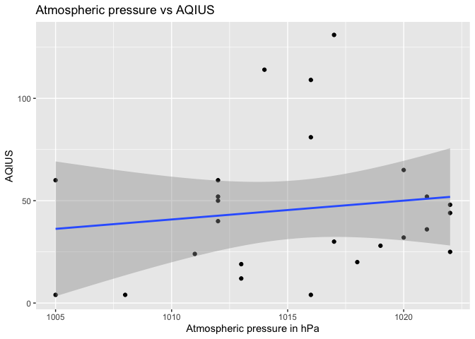
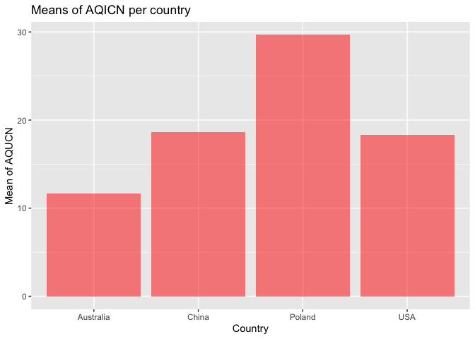
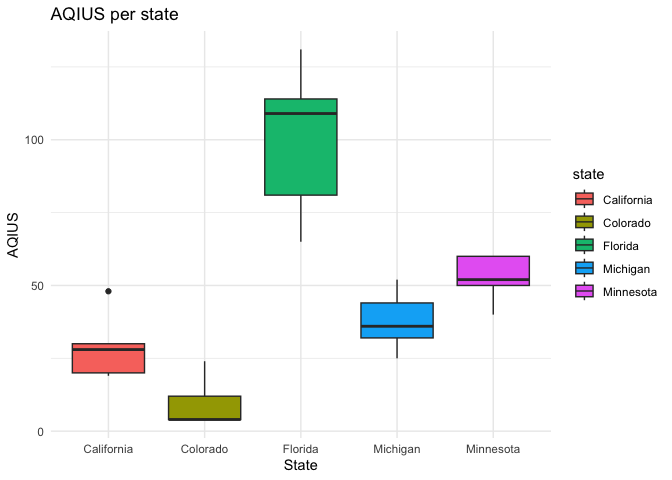
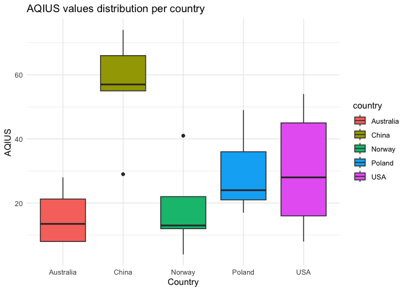
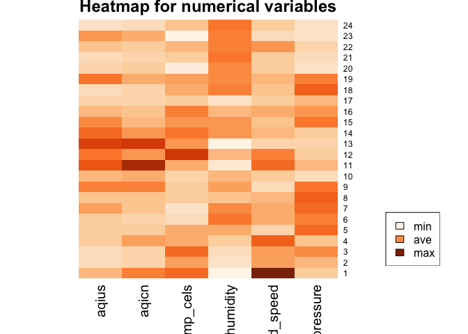
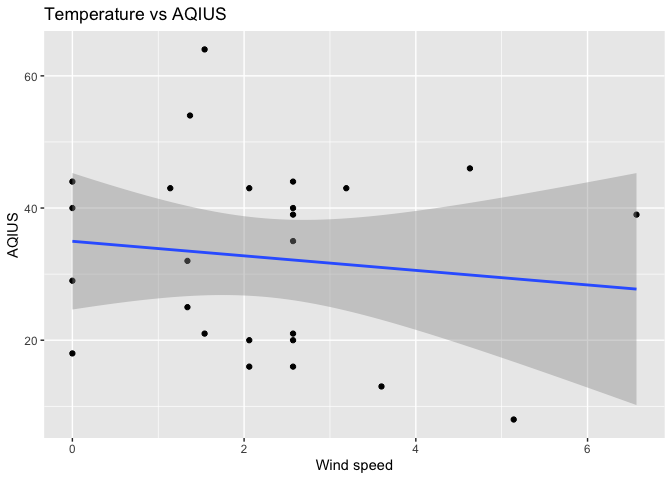
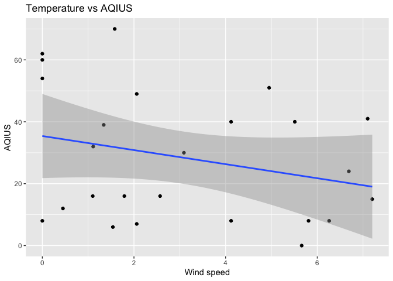
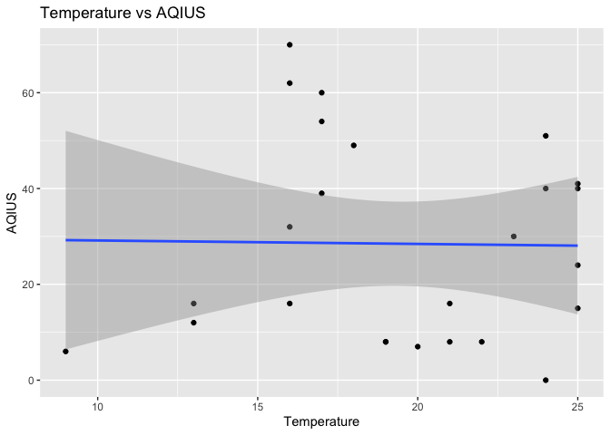
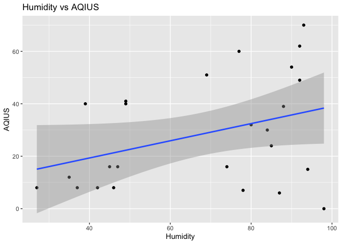

Project2
================
Nataliya Peshekhodko
2023-09-29

- <a href="#01-overall-goal" id="toc-01-overall-goal">0.1 Overall Goal</a>
  - <a href="#011-packages" id="toc-011-packages">0.1.1 Packages</a>
- <a href="#02-exploratory-data-analysis"
  id="toc-02-exploratory-data-analysis">0.2 Exploratory Data Analysis</a>
  - <a href="#021-looking-at-usa-states"
    id="toc-021-looking-at-usa-states">0.2.1 Looking at USA states</a>

## 0.1 Overall Goal

Vignettes are explanations of some concept, package, etc. with text,
code, and output interweaved. Our goal with this project is to create a
vignette about contacting an API using functions you’ve created to
query, parse, and return well-structured data. API endpoint used
<https://www.iqair.com/dashboard/api>

### 0.1.1 Packages

``` r
library(httr)
library(dplyr)
library(tibble)
library(jsonlite)
library(ggplot2)
```

``` r
key = '97d5c2b8-7656-4974-827e-9d59486f7777'
```

Function to get states for the provided country.

``` r
get_states <- function(country, api_key = key) {
  url = 'http://api.airvisual.com/v2/states'
  resp = GET(url, query = list(key = api_key, 
                               country = country))
  parsed = fromJSON(rawToChar(resp$content))
  
  return (as.list(parsed$data)$state)
}
```

Function to get cities for the provided country and state

``` r
get_cities <- function(country, state, api_key = key) {
  url = 'http://api.airvisual.com/v2/cities'
  
  resp = GET(url, query = list(key = api_key, 
                               country = country,
                               state = state))
  parsed = fromJSON(rawToChar(resp$content))
  return (as.list(parsed$data)$city)
}
```

``` r
get_air_quality_per_city <- function(country, 
                                     state, 
                                     city = NULL,
                                     weather_metrics = TRUE,
                                     sample_size = 5,
                                     api_key = key) {
  
  results = tibble()
  url = 'http://api.airvisual.com/v2/city'
 
  if (is.null(city)) {
    cities = get_cities(country, state)
  
    if (length(cities) > sample_size) {
      set.seed(123)
      cities = sample(cities, size = sample_size)
    }
    
    for (city in cities) {
      Sys.sleep(15)
      resp = GET(url, query = list(key = key, 
                                   country = country,
                                   state = state,
                                   city = city))
      parsed = fromJSON(rawToChar(resp$content))
      
      if (weather_metrics == TRUE) {
        subset_df = tibble(aqius = parsed$data$current$pollution$aqius, 
                           aqicn = parsed$data$current$pollution$aqicn, 
                           city = parsed$data$city,
                           state = parsed$data$state,
                           country = parsed$data$country,
                           temp_cels = parsed$data$current$weather$tp,
                           humidity = parsed$data$current$weather$hu, 
                           wind_speed = parsed$data$current$weather$ws,
                           atm_pressure = parsed$data$current$weather$pr)
      } else {
        subset_df = tibble(aqius = parsed$data$current$pollution$aqius, 
                           aqicn = parsed$data$current$pollution$aqicn, 
                           city = parsed$data$city,
                           state = parsed$data$state,
                           country = parsed$data$country)
      }
      results <- bind_rows(results, subset_df)
    
  }
    } else {
      resp = GET(url, query = list(key = key, 
                                   country = country,
                                   state = state,
                                   city = city))
      parsed = fromJSON(rawToChar(resp$content))
      if (weather_metrics == TRUE) {
        subset_df = tibble(aqius = parsed$data$current$pollution$aqius, 
                           aqicn = parsed$data$current$pollution$aqicn, 
                           city = parsed$data$city,
                           state = parsed$data$state,
                           country = parsed$data$country,
                           temp_cels = parsed$data$current$weather$tp,
                           humidity = parsed$data$current$weather$hu, 
                           wind_speed = parsed$data$current$weather$ws,
                           atm_pressure = parsed$data$current$weather$pr)
      } else {
        subset_df = tibble(aqius = parsed$data$current$pollution$aqius, 
                           aqicn = parsed$data$current$pollution$aqicn, 
                           city = parsed$data$city,
                           state = parsed$data$state,
                           country = parsed$data$country)
      }
      results <- bind_rows(results, subset_df)
  }
  return (results)
}
```

``` r
get_air_quality_per_country <- function(country, 
                                        weather_metrics = TRUE,
                                        sample_size = 5,
                                        api_key = key) {
  
  results = tibble()
  url = 'http://api.airvisual.com/v2/city'
  
  
  states = get_states(country, api_key = key)
  
  set.seed(2)
  states = sample(states, size = sample_size)
  
  
  for (state in states) {
    Sys.sleep(15)
    cities = get_cities(country, state, api_key = key)
    set.seed(4)
    city = sample(cities, size = 1)
    
    Sys.sleep(15)
    resp = GET(url, query = list(key = api_key, 
                                 country = country,
                                 state = state,
                                 city = city))
    parsed = fromJSON(rawToChar(resp$content))
    subset_df = tibble(aqius = parsed$data$current$pollution$aqius, 
                       aqicn = parsed$data$current$pollution$aqicn, 
                       city = parsed$data$city,
                       state = parsed$data$state,
                       country = parsed$data$country,
                       temp_cels = parsed$data$current$weather$tp,
                       humidity = parsed$data$current$weather$hu, 
                       wind_speed = parsed$data$current$weather$ws,
                       atm_pressure = parsed$data$current$weather$pr)
    results <- bind_rows(results, subset_df)
  }
  return (results)
}
```

``` r
res_usa_cal =  get_air_quality_per_city (country = 'USA', state = 'California', sample_size = 3)
```

``` r
res_usa_cal
```

    ## # A tibble: 3 × 9
    ##   aqius aqicn city      state      country temp_cels humidity wind_speed atm_pressure
    ##   <int> <int> <chr>     <chr>      <chr>       <int>    <int>      <dbl>        <int>
    ## 1    44    15 Maywood   California USA            19       80       2.57         1012
    ## 2     8     3 Newcastle California USA            18       57       5.14         1009
    ## 3    64    26 Del Mar   California USA            18       76       1.54         1012

``` r
t = get_air_quality_per_country(country = 'USA', sample_size = 2)
t
```

    ## # A tibble: 2 × 9
    ##   aqius aqicn city    state    country temp_cels humidity wind_speed atm_pressure
    ##   <int> <int> <chr>   <chr>    <chr>       <int>    <int>      <dbl>        <int>
    ## 1    58    22 Winslow Maine    USA            18       53       1.32         1026
    ## 2    60    24 Venice  Illinois USA            25       72       4.63         1019

## 0.2 Exploratory Data Analysis

Let’s look at air pollution for different countries across the globe:
China, USA, France, India, Kenya.

``` r
air_usa = get_air_quality_per_country(country = 'USA', sample_size = 3)
```

``` r
air_usa
```

    ## # A tibble: 3 × 9
    ##   aqius aqicn city    state    country temp_cels humidity wind_speed atm_pressure
    ##   <int> <int> <chr>   <chr>    <chr>       <int>    <int>      <dbl>        <int>
    ## 1    58    22 Winslow Maine    USA            18       53       1.32         1026
    ## 2    60    24 Venice  Illinois USA            25       72       4.63         1019
    ## 3    25     9 Walden  Colorado USA            14       26       4.12         1023

``` r
air_china = get_air_quality_per_country(country = 'China', sample_size = 3)
```

``` r
air_china
```

    ## # A tibble: 3 × 9
    ##   aqius aqicn city    state          country temp_cels humidity wind_speed atm_pressure
    ##   <int> <int> <chr>   <chr>          <chr>       <int>    <int>      <dbl>        <int>
    ## 1    39    14 Yushu   Qinghai        China           4       96       1.92         1017
    ## 2    29    15 Jining  Inner Mongolia China           5       72       1.94         1022
    ## 3    59    27 Huizhou Guangdong      China          26       82       0.68         1012

``` r
air_poland = get_air_quality_per_country(country = 'Poland', sample_size = 3)
air_poland
```

    ## # A tibble: 3 × 9
    ##   aqius aqicn city    state          country temp_cels humidity wind_speed atm_pressure
    ##   <int> <int> <chr>   <chr>          <chr>       <int>    <int>      <dbl>        <int>
    ## 1    48    37 Wroclaw Lower Silesia  Poland         24       55       2.57         1022
    ## 2    57    21 Goldap  Warmia-Masuria Poland         19       45       3.14         1017
    ## 3    53    31 Lublin  Lublin         Poland         22       48       2.57         1019

``` r
air_australia = get_air_quality_per_country(country = 'Australia', sample_size = 3)
air_australia
```

    ## # A tibble: 3 × 9
    ##   aqius aqicn city       state           country   temp_cels humidity wind_speed atm_pressure
    ##   <int> <int> <chr>      <chr>           <chr>         <int>    <int>      <dbl>        <int>
    ## 1    48    17 Smithfield South Australia Australia        17       41       3.58         1017
    ## 2    16     6 Werribee   Victoria        Australia        15       52       3.65         1019
    ## 3    21    12 Glenorchy  Tasmania        Australia         8       86       2.57         1006

``` r
all = bind_rows(air_australia, air_poland, air_china, air_usa)


all <- all %>%
  mutate(aqius_category = case_when(
    aqius < 50 ~ "good",
    aqius >= 50 & aqius <= 100 ~ "moderate",
    aqius > 100 ~ "unhealthy"
  )) %>%
  mutate(aqicn_category = case_when(
    aqius < 50 ~ "excellent",
    aqius >= 50 & aqius <= 100 ~ "good",
    aqius > 100 ~ "polluted"
  )) %>%
  mutate(humidity_category = case_when(
    humidity <= 40 ~ 'low',
    humidity > 40 & humidity <= 60 ~ 'normal',
    humidity > 60 ~ 'high'
  ))

 all 
```

    ## # A tibble: 12 × 12
    ##    aqius aqicn city       state       country temp_cels humidity wind_speed atm_pressure aqius_category aqicn_category
    ##    <int> <int> <chr>      <chr>       <chr>       <int>    <int>      <dbl>        <int> <chr>          <chr>         
    ##  1    48    17 Smithfield South Aust… Austra…        17       41       3.58         1017 good           excellent     
    ##  2    16     6 Werribee   Victoria    Austra…        15       52       3.65         1019 good           excellent     
    ##  3    21    12 Glenorchy  Tasmania    Austra…         8       86       2.57         1006 good           excellent     
    ##  4    48    37 Wroclaw    Lower Sile… Poland         24       55       2.57         1022 good           excellent     
    ##  5    57    21 Goldap     Warmia-Mas… Poland         19       45       3.14         1017 moderate       good          
    ##  6    53    31 Lublin     Lublin      Poland         22       48       2.57         1019 moderate       good          
    ##  7    39    14 Yushu      Qinghai     China           4       96       1.92         1017 good           excellent     
    ##  8    29    15 Jining     Inner Mong… China           5       72       1.94         1022 good           excellent     
    ##  9    59    27 Huizhou    Guangdong   China          26       82       0.68         1012 moderate       good          
    ## 10    58    22 Winslow    Maine       USA            18       53       1.32         1026 moderate       good          
    ## 11    60    24 Venice     Illinois    USA            25       72       4.63         1019 moderate       good          
    ## 12    25     9 Walden     Colorado    USA            14       26       4.12         1023 good           excellent     
    ## # ℹ 1 more variable: humidity_category <chr>

``` r
table(all$aqius_category, all$country)
```

    ##           
    ##            Australia China Poland USA
    ##   good             3     2      1   1
    ##   moderate         0     1      2   2

``` r
table(all$aqicn_category, all$country)
```

    ##            
    ##             Australia China Poland USA
    ##   excellent         3     2      1   1
    ##   good              0     1      2   2

``` r
table(all$aqius_category, all$humidity_category)
```

    ##           
    ##            high low normal
    ##   good        3   1      3
    ##   moderate    2   0      3

``` r
result <- all %>%
  group_by(country) %>%
  summarize(mean_aqius = mean(aqius), mean_aqicn = mean(aqicn)) 
result
```

    ## # A tibble: 4 × 3
    ##   country   mean_aqius mean_aqicn
    ##   <chr>          <dbl>      <dbl>
    ## 1 Australia       28.3       11.7
    ## 2 China           42.3       18.7
    ## 3 Poland          52.7       29.7
    ## 4 USA             47.7       18.3

``` r
ggplot(result, aes(x = country, y = mean_aqius)) +
  geom_bar(stat = "identity", fill = "blue", alpha = 0.5) +
  labs(title = "Means of AQIUS per country", x = "Country", y = "Mean of AQUIS")
```

<!-- -->

``` r
ggplot(result, aes(x = country, y = mean_aqicn)) +
  geom_bar(stat = "identity", fill = "red", alpha = 0.5) +
  labs(title = "Means of AQICN per country", x = "Country", y = "Mean of AQUCN")
```

<!-- -->

``` r
ggplot(all, aes(x = country, y = aqius, fill = country)) +
  geom_boxplot() +
  labs(title = "AQIUS per country", x = "Country", y = "AQIUS") +
  theme_minimal()
```

<!-- -->

``` r
#library(heatmaply)

data <- as.matrix(all %>% select(aqius, aqicn, temp_cels, humidity, wind_speed, atm_pressure))
#data
# Default Heatmap
heatmap(data, col = heat.colors(10),  Colv = NA, Rowv = NA, scale="column")
```

<!-- -->

``` r
#legend(
#  "topright",             # Legend position
#  legend = c("Low", "High"),  # Legend labels
#  fill = heat.colors(2),      # Colors for the legend
#  title = "Legend"            # Legend title
#)
```

``` r
ggplot(all, aes(x = temp_cels, y = aqius)) +
  geom_point() +                  # Add scatter points
  geom_smooth(method = "lm",      # Add a linear regression line
              formula = y ~ x,    # Regression formula
              se = TRUE) +      # Don't display confidence interval
  labs(title = "Temperature vs AQIUS",  # Main title
       x = "Temperature, Celsius",              # X-axis label
       y = "AQIUS")  
```

<!-- -->

### 0.2.1 Looking at USA states

``` r
air_california = get_air_quality_per_city(country = 'USA', state = 'California', sample_size = 5)
air_california
```

    ## # A tibble: 5 × 9
    ##   aqius aqicn city       state      country temp_cels humidity wind_speed atm_pressure
    ##   <int> <int> <chr>      <chr>      <chr>       <int>    <int>      <dbl>        <int>
    ## 1    44    15 Maywood    California USA            19       80       2.57         1012
    ## 2     8     3 Newcastle  California USA            18       57       5.14         1009
    ## 3    64    26 Del Mar    California USA            18       76       1.54         1012
    ## 4    40    14 Pine Grove California USA            16       55       0            1012
    ## 5    18     6 Dunsmuir   California USA            14       66       0            1011

``` r
air_colorado = get_air_quality_per_city(country = 'USA', state = 'Colorado', sample_size = 5)
air_colorado
```

    ## # A tibble: 5 × 9
    ##   aqius aqicn city            state    country temp_cels humidity wind_speed atm_pressure
    ##   <int> <int> <chr>           <chr>    <chr>       <int>    <int>      <dbl>        <int>
    ## 1    20     7 Del Norte       Colorado USA            15       30       2.06         1024
    ## 2    29    10 Leadville       Colorado USA            14       22       0            1026
    ## 3    43    15 Fort Lupton     Colorado USA            20       49       1.14         1010
    ## 4    20     7 Breckenridge    Colorado USA            14       25       2.57         1027
    ## 5    35    12 Highlands Ranch Colorado USA            20       38       2.57         1010

``` r
air_minnesota = get_air_quality_per_city(country = 'USA', state = 'Minnesota', sample_size = 5)
air_minnesota
```

    ## # A tibble: 5 × 9
    ##   aqius aqicn city                   state     country temp_cels humidity wind_speed atm_pressure
    ##   <int> <int> <chr>                  <chr>     <chr>       <int>    <int>      <dbl>        <int>
    ## 1    39    14 Lake Saint Croix Beach Minnesota USA            16       94       2.57         1017
    ## 2    46    16 Renville               Minnesota USA            18       86       4.63         1014
    ## 3    21     7 Cloquet                Minnesota USA            15       95       1.54         1016
    ## 4    21     7 Virginia               Minnesota USA            14       96       2.57         1015
    ## 5    39    14 Onamia                 Minnesota USA            17       90       6.57         1013

``` r
air_florida = get_air_quality_per_city(country = 'USA', state = 'Florida', sample_size = 5)
air_florida
```

    ## # A tibble: 5 × 9
    ##   aqius aqicn city         state   country temp_cels humidity wind_speed atm_pressure
    ##   <int> <int> <chr>        <chr>   <chr>       <int>    <int>      <dbl>        <int>
    ## 1    16     6 Lehigh Acres Florida USA            30       78       2.57         1014
    ## 2    32    11 Placid Lakes Florida USA            27       87       1.34         1015
    ## 3    13     5 Davie        Florida USA            31       69       3.6          1014
    ## 4    25     9 The Hammocks Florida USA            31       74       1.34         1012
    ## 5    43    15 Olustee      Florida USA            27       60       3.19         1017

``` r
air_michigan = get_air_quality_per_city(country = 'USA', state = 'Michigan', sample_size = 5)
air_michigan
```

    ## # A tibble: 5 × 9
    ##   aqius aqicn city           state    country temp_cels humidity wind_speed atm_pressure
    ##   <int> <int> <chr>          <chr>    <chr>       <int>    <int>      <dbl>        <int>
    ## 1    16     6 Harbor Springs Michigan USA            16       83       2.06         1022
    ## 2    40    14 Ypsilanti      Michigan USA            19       84       2.57         1021
    ## 3    54    20 Milford        Michigan USA            18       86       1.37         1020
    ## 4    44    15 Caro           Michigan USA            18       59       0            1022
    ## 5    43    15 Saginaw        Michigan USA            18       77       2.06         1018

``` r
all_per_state = bind_rows(air_michigan, air_florida, air_minnesota, air_colorado, air_california)
```

``` r
all_per_state <- all_per_state %>%
  mutate(aqius_category = case_when(
    aqius < 50 ~ "good",
    aqius >= 50 & aqius <= 100 ~ "moderate",
    aqius > 100 ~ "unhealthy"
  )) %>%
  mutate(aqicn_category = case_when(
    aqius < 50 ~ "excellent",
    aqius >= 50 & aqius <= 100 ~ "good",
    aqius > 100 ~ "polluted"
  )) %>%
  mutate(humidity_category = case_when(
    humidity <= 40 ~ 'low',
    humidity > 40 & humidity <= 60 ~ 'normal',
    humidity > 60 ~ 'high'
  ))
all_per_state 
```

    ## # A tibble: 25 × 12
    ##    aqius aqicn city           state   country temp_cels humidity wind_speed atm_pressure aqius_category aqicn_category
    ##    <int> <int> <chr>          <chr>   <chr>       <int>    <int>      <dbl>        <int> <chr>          <chr>         
    ##  1    16     6 Harbor Springs Michig… USA            16       83       2.06         1022 good           excellent     
    ##  2    40    14 Ypsilanti      Michig… USA            19       84       2.57         1021 good           excellent     
    ##  3    54    20 Milford        Michig… USA            18       86       1.37         1020 moderate       good          
    ##  4    44    15 Caro           Michig… USA            18       59       0            1022 good           excellent     
    ##  5    43    15 Saginaw        Michig… USA            18       77       2.06         1018 good           excellent     
    ##  6    16     6 Lehigh Acres   Florida USA            30       78       2.57         1014 good           excellent     
    ##  7    32    11 Placid Lakes   Florida USA            27       87       1.34         1015 good           excellent     
    ##  8    13     5 Davie          Florida USA            31       69       3.6          1014 good           excellent     
    ##  9    25     9 The Hammocks   Florida USA            31       74       1.34         1012 good           excellent     
    ## 10    43    15 Olustee        Florida USA            27       60       3.19         1017 good           excellent     
    ## # ℹ 15 more rows
    ## # ℹ 1 more variable: humidity_category <chr>

``` r
table(all_per_state$aqius_category, all_per_state$state)
```

    ##           
    ##            California Colorado Florida Michigan Minnesota
    ##   good              4        5       5        4         5
    ##   moderate          1        0       0        1         0

``` r
table(all_per_state$aqicn_category, all_per_state$state)
```

    ##            
    ##             California Colorado Florida Michigan Minnesota
    ##   excellent          4        5       5        4         5
    ##   good               1        0       0        1         0

``` r
table(all_per_state$aqius_category, all_per_state$humidity_category)
```

    ##           
    ##            high low normal
    ##   good       14   4      5
    ##   moderate    2   0      0

``` r
result <- all_per_state %>%
  group_by(state) %>%
  summarize(mean_aqius = mean(aqius), mean_aqicn = mean(aqicn)) 
result
```

    ## # A tibble: 5 × 3
    ##   state      mean_aqius mean_aqicn
    ##   <chr>           <dbl>      <dbl>
    ## 1 California       34.8       12.8
    ## 2 Colorado         29.4       10.2
    ## 3 Florida          25.8        9.2
    ## 4 Michigan         39.4       14  
    ## 5 Minnesota        33.2       11.6

``` r
all_per_state
```

    ## # A tibble: 25 × 12
    ##    aqius aqicn city           state   country temp_cels humidity wind_speed atm_pressure aqius_category aqicn_category
    ##    <int> <int> <chr>          <chr>   <chr>       <int>    <int>      <dbl>        <int> <chr>          <chr>         
    ##  1    16     6 Harbor Springs Michig… USA            16       83       2.06         1022 good           excellent     
    ##  2    40    14 Ypsilanti      Michig… USA            19       84       2.57         1021 good           excellent     
    ##  3    54    20 Milford        Michig… USA            18       86       1.37         1020 moderate       good          
    ##  4    44    15 Caro           Michig… USA            18       59       0            1022 good           excellent     
    ##  5    43    15 Saginaw        Michig… USA            18       77       2.06         1018 good           excellent     
    ##  6    16     6 Lehigh Acres   Florida USA            30       78       2.57         1014 good           excellent     
    ##  7    32    11 Placid Lakes   Florida USA            27       87       1.34         1015 good           excellent     
    ##  8    13     5 Davie          Florida USA            31       69       3.6          1014 good           excellent     
    ##  9    25     9 The Hammocks   Florida USA            31       74       1.34         1012 good           excellent     
    ## 10    43    15 Olustee        Florida USA            27       60       3.19         1017 good           excellent     
    ## # ℹ 15 more rows
    ## # ℹ 1 more variable: humidity_category <chr>

``` r
ggplot(all_per_state, aes(x = wind_speed, y = aqius)) +
  geom_point() +                  # Add scatter points
  geom_smooth(method = "lm",      # Add a linear regression line
              formula = y ~ x,    # Regression formula
              se = TRUE) +      # Don't display confidence interval
  labs(title = "Temperature vs AQIUS",  # Main title
       x = "Wind speed",              # X-axis label
       y = "AQIUS")  
```

<!-- -->

``` r
ggplot(all_per_state, aes(x = temp_cels, y = aqius)) +
  geom_point() +                  # Add scatter points
  geom_smooth(method = "lm",      # Add a linear regression line
              formula = y ~ x,    # Regression formula
              se = TRUE) +      # Don't display confidence interval
  labs(title = "Temperature vs AQIUS",  # Main title
       x = "Temperature",              # X-axis label
       y = "AQIUS")  
```

<!-- -->

``` r
ggplot(all_per_state, aes(x = humidity, y = aqius)) +
  geom_point() +                  # Add scatter points
  geom_smooth(method = "lm",      # Add a linear regression line
              formula = y ~ x,    # Regression formula
              se = TRUE) +      # Don't display confidence interval
  labs(title = "Temperature vs AQIUS",  # Main title
       x = "Humidity",              # X-axis label
       y = "AQIUS")  
```

<!-- -->

``` r
ggplot(all_per_state, aes(x = state, y = aqius, fill = state)) +
  geom_boxplot() +
  labs(title = "AQIUS per state", x = "State", y = "AQIUS") +
  theme_minimal()
```

<!-- -->
