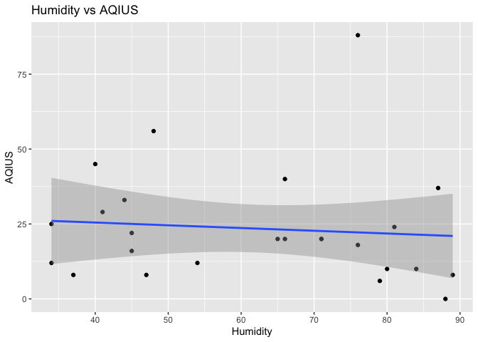

ST-558, Project 2
================
Nataliya Peshekhodko
2023-10-02

- <a
  href="#1-vignette-for-reading-and-summarizing-data-from-an-iqair-apis"
  id="toc-1-vignette-for-reading-and-summarizing-data-from-an-iqair-apis">1
  Vignette for reading and summarizing data from an IQAir APIs</a>
  - <a href="#11-overall-goal" id="toc-11-overall-goal">1.1 Overall Goal</a>
  - <a href="#12-packages" id="toc-12-packages">1.2 Packages</a>
  - <a href="#13-functions-for-reading-data-from-iqair-apis"
    id="toc-13-functions-for-reading-data-from-iqair-apis">1.3 Functions for
    reading data from IQAir APIs</a>
    - <a href="#131-get-states-function"
      id="toc-131-get-states-function">1.3.1 Get states function</a>
    - <a href="#132-get-cities-function"
      id="toc-132-get-cities-function">1.3.2 Get cities function</a>
    - <a
      href="#133-get-air-quality-and-weather-metrics-based-on-country-state-and-city-function"
      id="toc-133-get-air-quality-and-weather-metrics-based-on-country-state-and-city-function">1.3.3
      Get air quality and weather metrics based on country, state and city
      function</a>
    - <a href="#134-get-air-quality-and-weather-metrics-for-country-function"
      id="toc-134-get-air-quality-and-weather-metrics-for-country-function">1.3.4
      Get air quality and weather metrics for country function</a>
  - <a href="#14-exploratory-data-analysis"
    id="toc-14-exploratory-data-analysis">1.4 Exploratory Data Analysis</a>
    - <a href="#141-eda-for-countries" id="toc-141-eda-for-countries">1.4.1
      EDA for countries</a>
    - <a href="#142-eda-for-the-us-states"
      id="toc-142-eda-for-the-us-states">1.4.2 EDA for the US states</a>
  - <a href="#15-summary" id="toc-15-summary">1.5 Summary</a>

# 1 Vignette for reading and summarizing data from an IQAir APIs

## 1.1 Overall Goal

Vignettes are explanations of some concept, package, etc. with text,
code, and output interweaved. Our goal with this project is to create a
vignette about contacting an [IQAir
APIs](https://www.iqair.com/dashboard/api) using custom functions to
query, parse, and return well-structured data. IQAir APIs provide
information about **real time air quality data and weather metrics**.

## 1.2 Packages

Packages required to run code included in that analysis:

``` r
library(httr)
library(dplyr)
library(tibble)
library(jsonlite)
library(ggplot2)
library(RColorBrewer)
```

- `httr` - required for making HTTP requests
- `dplyr` - required for data manipulation
- `tibble` - required for formatting data frame
- `jsonlite` - required for converting JSON data from/to R objects
- `ggplot2` - required for creating graphs
- `RColorBrewer` - provides color schemes for maps

Define variable for API key required for the authentication during HTTP
request:

``` r
key = '97d5c2b8-7656-4974-827e-9d59486f7777'
```

## 1.3 Functions for reading data from IQAir APIs

This section is dedicated for helper functions required for HTTP
requests.

### 1.3.1 Get states function

Function to retrieve `states` based on the `country` name. States
returned as a list.

``` r
get_states <- function(country, api_key = key) {
  url = 'http://api.airvisual.com/v2/states'
  resp = GET(url, query = list(key = api_key, 
                               country = country))
  parsed = fromJSON(rawToChar(resp$content))
  
  return (as.list(parsed$data)$state)
}
```

### 1.3.2 Get cities function

Function to get `cities` based on the provided `country` and `state`.
Cities returned as a list.

``` r
get_cities <- function(country, state, api_key = key) {
  url = 'http://api.airvisual.com/v2/cities'
  
  resp = GET(url, query = list(key = api_key, 
                               country = country,
                               state = state))
  parsed = fromJSON(rawToChar(resp$content))
  return (as.list(parsed$data)$city)
}
```

### 1.3.3 Get air quality and weather metrics based on country, state and city function

Function returns air quality based on the `country`, `state` and `city`.

If `city` is not provided, random sample of the size `sample_size` will
be chosen from the cities which belong to the `state`.

If `weather_metrics = TRUE` in addition to air quality metrics, weather
metrics like, temperature, humidity, wind speed and pressure will be
returned.

Function returns data frame in `tibble` format with following columns:

- `country`
- `state`
- `city`
- `aqius` - AQI value based on US EPA standard
- `aqicn` - AQI value based on China MEP standard

If `weather_metrics = TRUE` in addition to the columns above, function
also returns:

- `temp_cels` - temperature in Celsius
- `humidity` - humidity %
- `wind_speed` - wind speed (m/s)
- `atm_pressure` - atmospheric pressure in hPa

``` r
get_air_quality_per_city <- function(country, 
                                     state, 
                                     city = NULL,
                                     weather_metrics = TRUE,
                                     sample_size = 5,
                                     api_key = key) {
  
  results = tibble()
  url = 'http://api.airvisual.com/v2/city'
 
  if (is.null(city)) {
    cities = get_cities(country, state)
  
    if (length(cities) > sample_size) {
      set.seed(123)
      cities = sample(cities, size = sample_size)
    }
    
    for (city in cities) {
      Sys.sleep(15) # required to avoid error - too many requests
      resp = GET(url, query = list(key = key, 
                                   country = country,
                                   state = state,
                                   city = city))
      parsed = fromJSON(rawToChar(resp$content))
      
      if (weather_metrics == TRUE) {
        subset_df = tibble(aqius = parsed$data$current$pollution$aqius, 
                           aqicn = parsed$data$current$pollution$aqicn, 
                           city = parsed$data$city,
                           state = parsed$data$state,
                           country = parsed$data$country,
                           temp_cels = parsed$data$current$weather$tp,
                           humidity = parsed$data$current$weather$hu, 
                           wind_speed = parsed$data$current$weather$ws,
                           atm_pressure = parsed$data$current$weather$pr)
      } else {
        subset_df = tibble(aqius = parsed$data$current$pollution$aqius, 
                           aqicn = parsed$data$current$pollution$aqicn, 
                           city = parsed$data$city,
                           state = parsed$data$state,
                           country = parsed$data$country)
      }
      results <- bind_rows(results, subset_df)
    
  }
    } else {
      resp = GET(url, query = list(key = key, 
                                   country = country,
                                   state = state,
                                   city = city))
      parsed = fromJSON(rawToChar(resp$content))
      if (weather_metrics == TRUE) {
        subset_df = tibble(aqius = parsed$data$current$pollution$aqius, 
                           aqicn = parsed$data$current$pollution$aqicn, 
                           city = parsed$data$city,
                           state = parsed$data$state,
                           country = parsed$data$country,
                           temp_cels = parsed$data$current$weather$tp,
                           humidity = parsed$data$current$weather$hu, 
                           wind_speed = parsed$data$current$weather$ws,
                           atm_pressure = parsed$data$current$weather$pr)
      } else {
        subset_df = tibble(aqius = parsed$data$current$pollution$aqius, 
                           aqicn = parsed$data$current$pollution$aqicn, 
                           city = parsed$data$city,
                           state = parsed$data$state,
                           country = parsed$data$country)
      }
      results <- bind_rows(results, subset_df)
  }
  return (results)
}
```

### 1.3.4 Get air quality and weather metrics for country function

Function returns air quality and weather metrics based on the country
name. Random sample of the size `sample_size` is thrown from from the
states which belongs to the country. For each state, random city is
selected and metrics returned.

Functions returns data frame in `tibble` format with following columns:

- `country`
- `state`
- `city`
- `aqius` - AQI value based on US EPA standard
- `aqicn` - AQI value based on China MEP standard
- `temp_cels` - temperature in Celsius
- `humidity` - humidity %
- `wind_speed` - wind speed (m/s)
- `atm_pressure` - atmospheric pressure in hPa

``` r
get_air_quality_per_country <- function(country, 
                                        weather_metrics = TRUE,
                                        sample_size = 5,
                                        api_key = key) {
  
  results = tibble()
  url = 'http://api.airvisual.com/v2/city'
  
  
  states = get_states(country, api_key = key)
  
  set.seed(2)
  states = sample(states, size = sample_size)
  
  
  for (state in states) {
    Sys.sleep(15) # required to avoid error - too many requests
    cities = get_cities(country, state, api_key = key)
    set.seed(4)
    city = sample(cities, size = 1)
    
    Sys.sleep(15) # required to avoid error - too many requests
    resp = GET(url, query = list(key = api_key, 
                                 country = country,
                                 state = state,
                                 city = city))
    parsed = fromJSON(rawToChar(resp$content))
    subset_df = tibble(aqius = parsed$data$current$pollution$aqius, 
                       aqicn = parsed$data$current$pollution$aqicn, 
                       city = parsed$data$city,
                       state = parsed$data$state,
                       country = parsed$data$country,
                       temp_cels = parsed$data$current$weather$tp,
                       humidity = parsed$data$current$weather$hu, 
                       wind_speed = parsed$data$current$weather$ws,
                       atm_pressure = parsed$data$current$weather$pr)
    results <- bind_rows(results, subset_df)
  }
  return (results)
}
```

## 1.4 Exploratory Data Analysis

### 1.4.1 EDA for countries

Let’s look at air quality and weather metrics for different countries
across the globe. Chosen countries: China, USA, Poland, Australia,
Norway.

*Note: Sample size and set of countries chosen to be small due to API
limitations and time required to render the whole document*

``` r
sample = 5
air_usa = get_air_quality_per_country(country = 'USA', sample_size = sample)
air_china = get_air_quality_per_country(country = 'China', sample_size = sample)
air_poland = get_air_quality_per_country(country = 'Poland', sample_size = sample)
air_australia = get_air_quality_per_country(country = 'Australia', sample_size = sample)
air_norway = get_air_quality_per_country(country = 'Norway', sample_size = sample)
```

Combine all obtained data frames together in one data frame.

``` r
all = bind_rows(air_australia, air_poland, air_china, air_usa, air_norway)
```

Let’s look at data frame with combined records:

``` r
all
```

    ## # A tibble: 24 × 9
    ##    aqius aqicn city           state             country   temp_cels humidity wind_speed atm_pressure
    ##    <int> <int> <chr>          <chr>             <chr>         <int>    <int>      <dbl>        <int>
    ##  1    27    30 West Footscray Victoria          Australia        19       53       7.72         1005
    ##  2    33    15 Scottsdale     Tasmania          Australia         7       89       2.44         1008
    ##  3     8     3 Forrest        ACT               Australia        18       64       2.06         1018
    ##  4    16    18 Joondalup      Western Australia Australia        14       69       3.13         1019
    ##  5    33    13 Trzebnica      Lower Silesia     Poland           23       52       0.89         1022
    ##  6    33    15 Goldap         Warmia-Masuria    Poland           18       54       4.44         1020
    ##  7    43    24 Lublin         Lublin            Poland           19       51       3.58         1022
    ##  8    13     8 Wloszczowa     Swietokrzyskie    Poland           21       52       2.73         1023
    ##  9    38    42 Warsaw         Mazovia           Poland           21       56       3.6          1021
    ## 10    39    15 Yushu          Qinghai           China             9       72       2.04         1008
    ## # ℹ 14 more rows

Now, we need to create categorical variables for `aqius`, `aqicn` and
`humidity`.

If `aqius` value is less than **50**, the air quality is considered to
be `good`. If `aqius` value is greater or equal **50** and less or equal
**100**, the air quality is considered to be `moderate`. If `aquis`
value is greater than **100**, the air quality is considered
`unhealthy`.

If `aqicn` value is less than **50**, the air quality is considered to
be `excellent`, if `aqicn` value is greater or equal **50** and lees or
equal **100**, the air quality is considered to be `good`. If `aqicn`
value is greater than **100**, the air quality is considered `polluted`.

If `humidity` level is less or equal **40%**, it is considered `low`. If
`humidity` level is greater than **40%** and less than or equal to
**60%**, it is considered `normal`. If `humidity` is greater than
**60%**, it is considered `high`.

Creating new categorical variables based on the rules outlined above and
displaying updated data frame.

``` r
all <- all %>%
  mutate(aqius_category = case_when(
    aqius < 50 ~ "good",
    aqius >= 50 & aqius <= 100 ~ "moderate",
    aqius > 100 ~ "unhealthy"
  )) %>%
  mutate(aqicn_category = case_when(
    aqicn < 50 ~ "excellent",
    aqicn >= 50 & aqicn <= 100 ~ "good",
    aqicn > 100 ~ "polluted"
  )) %>%
  mutate(humidity_category = case_when(
    humidity <= 40 ~ 'low',
    humidity > 40 & humidity <= 60 ~ 'normal',
    humidity > 60 ~ 'high'
  ))
 all 
```

    ## # A tibble: 24 × 12
    ##    aqius aqicn city         state country temp_cels humidity wind_speed atm_pressure aqius_category aqicn_category humidity_category
    ##    <int> <int> <chr>        <chr> <chr>       <int>    <int>      <dbl>        <int> <chr>          <chr>          <chr>            
    ##  1    27    30 West Footsc… Vict… Austra…        19       53       7.72         1005 good           excellent      normal           
    ##  2    33    15 Scottsdale   Tasm… Austra…         7       89       2.44         1008 good           excellent      high             
    ##  3     8     3 Forrest      ACT   Austra…        18       64       2.06         1018 good           excellent      high             
    ##  4    16    18 Joondalup    West… Austra…        14       69       3.13         1019 good           excellent      high             
    ##  5    33    13 Trzebnica    Lowe… Poland         23       52       0.89         1022 good           excellent      normal           
    ##  6    33    15 Goldap       Warm… Poland         18       54       4.44         1020 good           excellent      normal           
    ##  7    43    24 Lublin       Lubl… Poland         19       51       3.58         1022 good           excellent      normal           
    ##  8    13     8 Wloszczowa   Swie… Poland         21       52       2.73         1023 good           excellent      normal           
    ##  9    38    42 Warsaw       Mazo… Poland         21       56       3.6          1021 good           excellent      normal           
    ## 10    39    15 Yushu        Qing… China           9       72       2.04         1008 good           excellent      high             
    ## # ℹ 14 more rows

*Note: in the following sections I will be doing EDA and results
interpretation. Given the data, I am retrieving every time I render the
document, is real time data, it could be some discrepancies between
observed values and I my interpretation, but I will try my best to be
consistent with values and interpretation.*

Create 2-way contingency table for `aqius_category` vs `country`.

``` r
table(all$aqius_category, all$country)
```

    ##           
    ##            Australia China Norway Poland USA
    ##   good             4     2      5      5   3
    ##   moderate         0     3      0      0   2

As it could be seen from the table above, `China` has at least one city
with `unhealthy` air based on `aqius` values. All sampled cities for
`Australia` and `Norway` have `good` air quality.

Create 2-way contingency table for `aqicn_category` vs `country`.

``` r
table(all$aqicn_category, all$country)
```

    ##            
    ##             Australia China Norway Poland USA
    ##   excellent         4     3      5      5   5
    ##   good              0     2      0      0   0

Based on the `aqicn` values, all selected cities for all countries,
except `China` have `excellent` air quality.

Create 2-way contingency table for `aqius_category` vs
`humidity_category`.

``` r
table(all$aqius_category, all$humidity_category)
```

    ##           
    ##            high low normal
    ##   good       12   0      7
    ##   moderate    3   1      1

Create 2-way contingency table for `aqicn_category` vs
`humidity_category`.

``` r
table(all$aqicn_category, all$humidity_category)
```

    ##            
    ##             high low normal
    ##   excellent   15   0      7
    ##   good         0   1      1

Based on the two tables above, the most observations for the `excellent`
and `good` air quality are for the `high` humidity level.

Now, let’s group by `country` and calculate `aqius` mean, `aqicn` mean
and standard deviations for each group.

``` r
result <- all %>%
  group_by(country) %>%
  summarize(mean_aqius = mean(aqius), 
            mean_aqicn = mean(aqicn), 
            sd_aquis = sd(aqius),
            sd_aqicn = sd(aqicn)) 
result
```

    ## # A tibble: 5 × 5
    ##   country   mean_aqius mean_aqicn sd_aquis sd_aqicn
    ##   <chr>          <dbl>      <dbl>    <dbl>    <dbl>
    ## 1 Australia       21         16.5    11.2     11.1 
    ## 2 China           64         36      26.6     18.6 
    ## 3 Norway          17.6        8.6     8.85     4.39
    ## 4 Poland          32         20.4    11.4     13.4 
    ## 5 USA             35.8       13.4    26.5     10.6

Based on the values above, `China` has the highest values for `aqius`
and `aqicn`, while `Australia` has the lowest values for `aqius` and
`aqicn`.

Visualizing obtained results for `aqius`.

``` r
ggplot(result, aes(x = country, y = mean_aqius)) +
  geom_bar(stat = "identity", fill = "blue", alpha = 0.5) +
  labs(title = "Means of AQIUS per country", x = "Country", y = "Mean of AQIUS")
```

<!-- -->

Visualizing obtained results for `aqicn`.

``` r
ggplot(result, aes(x = country, y = mean_aqicn)) +
  geom_bar(stat = "identity", fill = "red", alpha = 0.5) +
  labs(title = "Means of AQICN per country", x = "Country", y = "Mean of AQUCN")
```

<!-- -->

The graphs above shows means for the `aqius` and `aqicn`. `China` has
the highest values for `aqius` and `aqicn`, while `Australia` has the
lowest values for `aqius` and `aqicn`.

Let’s look at `aqius` distribution for each country. Creating box plot
for `aqius` per `country`.

``` r
ggplot(all, aes(x = country, y = aqius, fill = country)) +
  geom_boxplot() +
  labs(title = "AQIUS values distribution per country", x = "Country", y = "AQIUS") +
  theme_minimal()
```

<!-- --> Creating
heatmap for numerical variables

``` r
data <- as.matrix(all %>% select(aqius, aqicn, temp_cels, humidity, wind_speed, atm_pressure))
heatmap(data,
        Rowv=NA,
        Colv=NA, 
        labCol=colnames(data), 
        col= colorRampPalette(brewer.pal(8, "Oranges"))(25), 
        scale="column",
        main="Heatmap for numerical variables")
legend(x="bottomright", legend=c("min", "ave", "max"), 
     fill=colorRampPalette(brewer.pal(8, "Oranges"))(3))
```

<!-- -->

Let’s looks at correlation matrix for all numerical variables.

``` r
cor(data)
```

    ##                    aqius       aqicn   temp_cels    humidity  wind_speed atm_pressure
    ## aqius         1.00000000  0.85793910  0.32030817 -0.30684359 -0.08387897   0.02162394
    ## aqicn         0.85793910  1.00000000  0.34538488 -0.39730885  0.11932716  -0.05659094
    ## temp_cels     0.32030817  0.34538488  1.00000000 -0.51973187 -0.02346306   0.31272753
    ## humidity     -0.30684359 -0.39730885 -0.51973187  1.00000000 -0.14725558   0.01288953
    ## wind_speed   -0.08387897  0.11932716 -0.02346306 -0.14725558  1.00000000  -0.34628755
    ## atm_pressure  0.02162394 -0.05659094  0.31272753  0.01288953 -0.34628755   1.00000000

From the matrix above, it could be seen that there are some positive
linear correlation between `aqius` and `atm_pressure`, `aqius` and
`temp_cels`, `aqicn` and `temp_cels`, `aqicn` and `atm_pressure`. There
are some negative linear correlation between `aqius` and `wind_speed`,
`aqicn` and `humidity`, `aqicn` and `wind_speed`.

Let’s check if there are any linear dependency between current
temperature and observed `aquis` values.

``` r
ggplot(all, aes(x = temp_cels, y = aqius)) +
  geom_point() +          
  geom_smooth(method = "lm",
              formula = y ~ x,
              se = TRUE) +
  labs(title = "Temperature vs AQIUS",
       x = "Temperature, Celsius",
       y = "AQIUS")  
```

<!-- -->

As, it could be seen from the graph above, there are might be some
relationship between temperature and observed `aquis` values. The higher
the temperature, the higher the `aquis` values.

### 1.4.2 EDA for the US states

Now, let’s look at several states across `USA` and compare air quality.
Chosen states: *California*, *Colorado*, *Minnesota*, *Florida* and
*Michigan*. Sample size for each state is equal to `5`.

Reading data for each state using function `get_air_quality_per_city`:

``` r
sample = 5
air_california = get_air_quality_per_city(country = 'USA', state = 'California', sample_size = sample)
air_colorado = get_air_quality_per_city(country = 'USA', state = 'Colorado', sample_size = sample)
air_minnesota = get_air_quality_per_city(country = 'USA', state = 'Minnesota', sample_size = sample)
air_florida = get_air_quality_per_city(country = 'USA', state = 'Florida', sample_size = sample)
air_michigan = get_air_quality_per_city(country = 'USA', state = 'Michigan', sample_size = sample)
```

Combine results in one data frame:

``` r
all_per_state = bind_rows(air_michigan, air_florida, air_minnesota, air_colorado, air_california)
all_per_state
```

    ## # A tibble: 25 × 9
    ##    aqius aqicn city           state    country temp_cels humidity wind_speed atm_pressure
    ##    <int> <int> <chr>          <chr>    <chr>       <int>    <int>      <dbl>        <int>
    ##  1    41    14 Harbor Springs Michigan USA            17       90       2.57         1024
    ##  2    29    10 Ypsilanti      Michigan USA            16       94       0            1026
    ##  3    67    28 Millington     Michigan USA            15       75       1.89         1024
    ##  4    60    24 Caro           Michigan USA            15       77       0            1025
    ##  5    52    18 Saginaw        Michigan USA            16       93       1.54         1021
    ##  6    49    17 Middleburg     Florida  USA            24       82       4.12         1018
    ##  7    26     9 Safety Harbor  Florida  USA            23       87       4.63         1015
    ##  8    12     4 Davie          Florida  USA            26       80       4.63         1013
    ##  9    12     4 Avon Park      Florida  USA            25       81       4.48         1015
    ## 10    57    21 Panama City    Florida  USA            20       83       4.12         1018
    ## # ℹ 15 more rows

Now, let’s use the same rules as outlined above, to create categorical
variables `aqius_category`, `aqicn_category` and `humidity_category` and
display updated data frame.

``` r
all_per_state <- all_per_state %>%
  mutate(aqius_category = case_when(
    aqius < 50 ~ "good",
    aqius >= 50 & aqius <= 100 ~ "moderate",
    aqius > 100 ~ "unhealthy"
  )) %>%
  mutate(aqicn_category = case_when(
    aqius < 50 ~ "excellent",
    aqius >= 50 & aqius <= 100 ~ "good",
    aqius > 100 ~ "polluted"
  )) %>%
  mutate(humidity_category = case_when(
    humidity <= 40 ~ 'low',
    humidity > 40 & humidity <= 60 ~ 'normal',
    humidity > 60 ~ 'high'
  ))
all_per_state 
```

    ## # A tibble: 25 × 12
    ##    aqius aqicn city         state country temp_cels humidity wind_speed atm_pressure aqius_category aqicn_category humidity_category
    ##    <int> <int> <chr>        <chr> <chr>       <int>    <int>      <dbl>        <int> <chr>          <chr>          <chr>            
    ##  1    41    14 Harbor Spri… Mich… USA            17       90       2.57         1024 good           excellent      high             
    ##  2    29    10 Ypsilanti    Mich… USA            16       94       0            1026 good           excellent      high             
    ##  3    67    28 Millington   Mich… USA            15       75       1.89         1024 moderate       good           high             
    ##  4    60    24 Caro         Mich… USA            15       77       0            1025 moderate       good           high             
    ##  5    52    18 Saginaw      Mich… USA            16       93       1.54         1021 moderate       good           high             
    ##  6    49    17 Middleburg   Flor… USA            24       82       4.12         1018 good           excellent      high             
    ##  7    26     9 Safety Harb… Flor… USA            23       87       4.63         1015 good           excellent      high             
    ##  8    12     4 Davie        Flor… USA            26       80       4.63         1013 good           excellent      high             
    ##  9    12     4 Avon Park    Flor… USA            25       81       4.48         1015 good           excellent      high             
    ## 10    57    21 Panama City  Flor… USA            20       83       4.12         1018 moderate       good           high             
    ## # ℹ 15 more rows

Create 2-way contingency table for `aqius_category` vs `state`.

``` r
table(all_per_state$aqius_category, all_per_state$state)
```

    ##           
    ##            California Colorado Florida Michigan Minnesota
    ##   good              5        5       4        2         5
    ##   moderate          0        0       1        3         0

Based on the table above, Michigan has 4 states out of 5 with `moderate`
air quality. California, Colorado and Florida have all 5 cities with
`good` air quality.

Create 2-way contingency table for `aqicn_category` vs `state`.

``` r
table(all_per_state$aqicn_category, all_per_state$state)
```

    ##            
    ##             California Colorado Florida Michigan Minnesota
    ##   excellent          5        5       4        2         5
    ##   good               0        0       1        3         0

Based on the table above, Michigan has 4 states out of 5 with `good` air
quality.

Create 2-way contingency table for `aqius_category` vs
`humidity_category`.

``` r
table(all_per_state$aqius_category, all_per_state$humidity_category)
```

    ##           
    ##            high normal
    ##   good       20      1
    ##   moderate    4      0

Most of the observations with `good` air quality are from observations
with `high` humidity.

Create 2-way contingency table for `aqicn_category` vs
`humidity_category`.

``` r
table(all_per_state$aqicn_category, all_per_state$humidity_category)
```

    ##            
    ##             high normal
    ##   excellent   20      1
    ##   good         4      0

Most of the observations with `exellent` air quality are from
observations with `high` humidity.

Let’s looks at correlation matrix for all numerical variables.

``` r
data <- as.matrix(all_per_state %>% select(aqius, aqicn, temp_cels, humidity, wind_speed, atm_pressure))
cor(data)
```

    ##                   aqius       aqicn temp_cels    humidity   wind_speed atm_pressure
    ## aqius        1.00000000  0.98992295 0.3171164 0.261571712  0.011875622   0.62554984
    ## aqicn        0.98992295  1.00000000 0.2721327 0.216027369 -0.034387752   0.63288426
    ## temp_cels    0.31711643  0.27213266 1.0000000 0.215532418  0.551703271   0.18362622
    ## humidity     0.26157171  0.21602737 0.2155324 1.000000000  0.000708942   0.31529663
    ## wind_speed   0.01187562 -0.03438775 0.5517033 0.000708942  1.000000000   0.01719351
    ## atm_pressure 0.62554984  0.63288426 0.1836262 0.315296632  0.017193511   1.00000000

From the matrix above, it could be seen that there are some positive
linear correlation between `aqius` and `atm_pressure`, `aqius` and
`temp_cels`, `aqius` and `humidity`, `aqicn` and `temp_cels`, `aqicn`
and `atm_pressure`, `aqicn` and `humidity`. There are some negative
linear correlation between `aqius` and `wind_speed`, `aqicn` and
`wind_speed`.

Now, let’s group by `state` and calculate `aqius` mean, `aqicn` mean and
standard deviations for each group.

``` r
result <- all_per_state %>%
  group_by(state) %>%
  summarize(mean_aqius = mean(aqius), 
            mean_aqicn = mean(aqicn), 
            sd_aquis = sd(aqius),
            sd_aqicn = sd(aqicn)) 
result
```

    ## # A tibble: 5 × 5
    ##   state      mean_aqius mean_aqicn sd_aquis sd_aqicn
    ##   <chr>           <dbl>      <dbl>    <dbl>    <dbl>
    ## 1 California       18          6.4    10        3.21
    ## 2 Colorado         16          5.8     5.66     1.79
    ## 3 Florida          31.2       11      20.9      7.71
    ## 4 Michigan         49.8       18.8    15.1      7.29
    ## 5 Minnesota        35.6       12.4    11.1      3.85

Let’s check if there are any linear dependency between wind speed and
observed `aquis` values.

``` r
ggplot(all_per_state, aes(x = wind_speed, y = aqius)) +
  geom_point() +                 
  geom_smooth(method = "lm", 
              formula = y ~ x,
              se = TRUE) + 
  labs(title = "Temperature vs AQIUS", 
       x = "Wind speed",
       y = "AQIUS")  
```

<!-- -->

As it could be seen from the graph, the stronger the wind, the lower the
`aqius` values.

Let’s check if there are any linear dependency between temperature and
observed `aquis` values.

``` r
ggplot(all_per_state, aes(x = temp_cels, y = aqius)) +
  geom_point() + 
  geom_smooth(method = "lm", 
              formula = y ~ x,
              se = TRUE) + 
  labs(title = "Temperature vs AQIUS", 
       x = "Temperature", 
       y = "AQIUS")  
```

<!-- -->

As it could be seen from the graph above, the higher the temperature,
the higher `aqius` values.

Let’s check if there are any linear dependency between humidity level
and observed `aquis` values.

``` r
ggplot(all_per_state, aes(x = humidity, y = aqius)) +
  geom_point() + 
  geom_smooth(method = "lm",
              formula = y ~ x, 
              se = TRUE) + 
  labs(title = "Humidity vs AQIUS", 
       x = "Humidity",
       y = "AQIUS") 
```

<!-- -->

As it could be seen from the graph above, there is may be some linear
relationship between humidity levels and `aqius` values. The higher the
humidity, the higher the `aquis` values.

Let’s check if there are any linear dependency between atmospheric
pressure and observed `aquis` values.

``` r
ggplot(all_per_state, aes(x = atm_pressure, y = aqius)) +
  geom_point() + 
  geom_smooth(method = "lm",
              formula = y ~ x, 
              se = TRUE) + 
  labs(title = "Atmospheric pressure vs AQIUS", 
       x = "Atmospheric pressure in hPa",
       y = "AQIUS") 
```

<!-- -->

As it could be seen from the graph above, the higher the atmospheric
pressure, the higher the `aqius`.

Let’s look at `aqius` distribution for each `state`. Creating box plot
for `aqius` per `state`.

``` r
ggplot(all_per_state, aes(x = state, y = aqius, fill = state)) +
  geom_boxplot() +
  labs(title = "AQIUS per state", x = "State", y = "AQIUS") +
  theme_minimal()
```

<!-- -->

## 1.5 Summary

At this project we created functions to query **IQAir APIs** to retrieve
data quality and weather metrics per country, state and city. Due to
free account limitations, small samples were derived for several
countries across the globe and several states across the United States.
For both data frames EDA was conducted. The EDA showed that:

- there are negative linear correlation between wind speed and air
  quality
- air quality is better when humidity level is high
- air quality is decreasing when atmospheric pressure is increasing.
