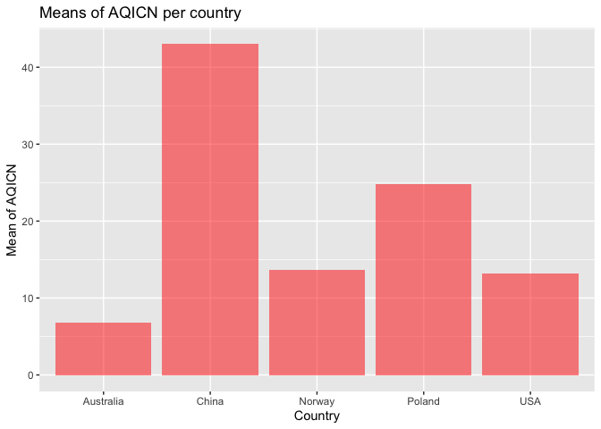
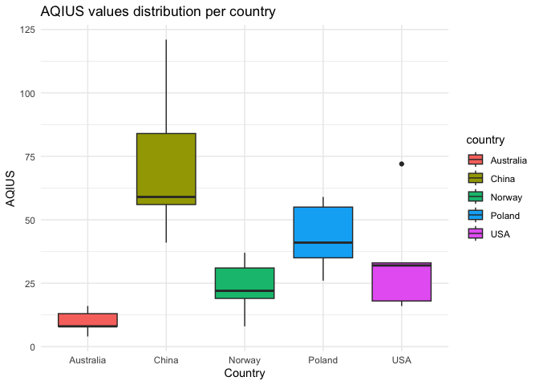
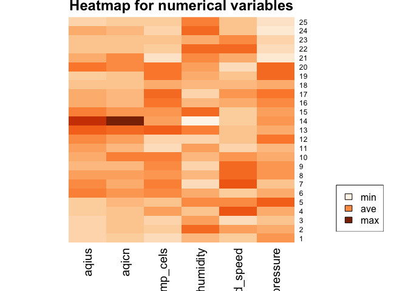
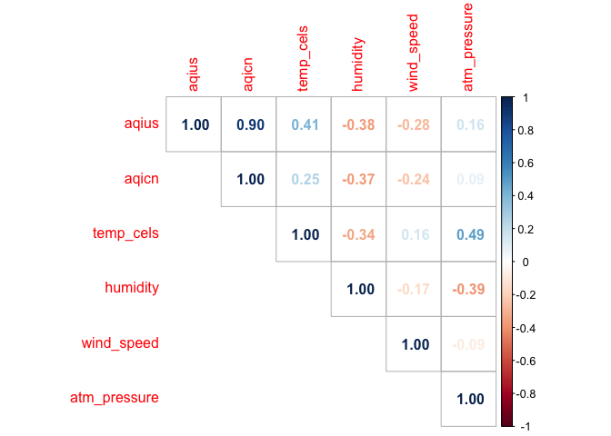
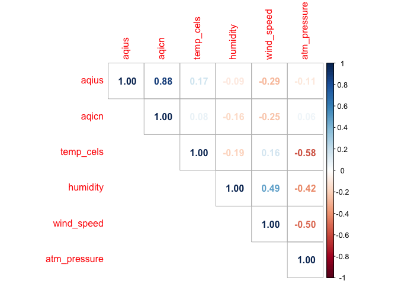
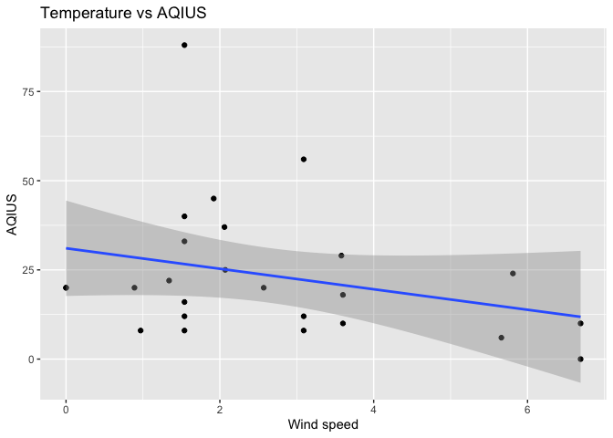
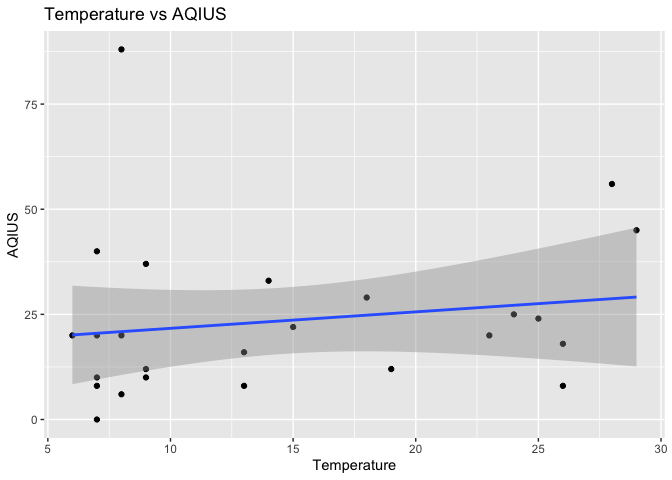

ST-558 Project 2 (Reading and summarizing data from an IQAir APIs)
================
Nataliya Peshekhodko
2023-10-03

- <a href="#1-overall-goal" id="toc-1-overall-goal">1 Overall Goal</a>
- <a href="#2-packages" id="toc-2-packages">2 Packages</a>
- <a href="#3-functions-for-reading-data-from-iqair-apis"
  id="toc-3-functions-for-reading-data-from-iqair-apis">3 Functions for
  reading data from IQAir APIs</a>
  - <a href="#31-function-to-get-states"
    id="toc-31-function-to-get-states">3.1 Function to get states</a>
  - <a href="#32-function-to-get-cities"
    id="toc-32-function-to-get-cities">3.2 Function to get cities</a>
  - <a
    href="#33-function-get-air-quality-and-weather-metrics-based-on-the-country-state-and-city"
    id="toc-33-function-get-air-quality-and-weather-metrics-based-on-the-country-state-and-city">3.3
    Function get air quality and weather metrics based on the country, state
    and city</a>
  - <a
    href="#34-function-to-get-air-quality-and-weather-metrics-for-country"
    id="toc-34-function-to-get-air-quality-and-weather-metrics-for-country">3.4
    Function to get air quality and weather metrics for country</a>
- <a href="#4-exploratory-data-analysis"
  id="toc-4-exploratory-data-analysis">4 Exploratory Data Analysis</a>
  - <a href="#41-eda-for-countries" id="toc-41-eda-for-countries">4.1 EDA
    for countries</a>
  - <a href="#42-eda-for-the-us-states"
    id="toc-42-eda-for-the-us-states">4.2 EDA for the US states</a>
- <a href="#5-summary" id="toc-5-summary">5 Summary</a>

# 1 Overall Goal

Vignettes are explanations of concepts, packages, or other topics that
interweave text, code, and output. Our project’s goal is to create a
vignette focused on interacting with the [IQAir
APIs](https://www.iqair.com/dashboard/api) using custom functions to
query, parse, and retrieve well-structured data. After the functions are
available, we conduct basic exploratory data analysis on the data
obtained from API endpoints.

The **IQAir APIs** provide information about **real-time air quality**
and **weather metrics**.

# 2 Packages

Packages required to run code included in that analysis:

``` r
library(httr)
library(dplyr)
library(tibble)
library(jsonlite)
library(ggplot2)
library(RColorBrewer)
```

- `httr` - required for making HTTP requests
- `dplyr` - required for data manipulation
- `tibble` - required for formatting data frame
- `jsonlite` - required for converting JSON data from/to R objects
- `ggplot2` - required for creating graphs
- `RColorBrewer` - provides color schemes for maps

# 3 Functions for reading data from IQAir APIs

This section is dedicated for functions developed for `IQAir APIs`
interaction.

Create variable with API key required for the authentication during HTTP
request:

``` r
key = '97d5c2b8-7656-4974-827e-9d59486f7777'
```

## 3.1 Function to get states

Function to retrieve `states` based on the `country` name. States
returned as a list.

``` r
get_states <- function(country, api_key = key) {
  url = 'http://api.airvisual.com/v2/states'
  resp = GET(url, query = list(key = api_key, 
                               country = country))
  parsed = fromJSON(rawToChar(resp$content))
  
  return (as.list(parsed$data)$state)
}
```

## 3.2 Function to get cities

Function to get `cities` based on the provided `country` and `state`.
Cities returned as a list.

``` r
get_cities <- function(country, state, api_key = key) {
  url = 'http://api.airvisual.com/v2/cities'
  
  resp = GET(url, query = list(key = api_key, 
                               country = country,
                               state = state))
  parsed = fromJSON(rawToChar(resp$content))
  return (as.list(parsed$data)$city)
}
```

## 3.3 Function get air quality and weather metrics based on the country, state and city

Function returns air quality based on the `country`, `state` and `city`.

If `city` is not provided, random sample of the size `sample_size` will
be chosen from the cities which belong to the `state`.

If `weather_metrics = TRUE` in addition to air quality metrics, weather
metrics like, `temperature`, `humidity`, `wind speed` and
`atmospheric pressure` will be returned.

Function returns data frame in `tibble` format with following columns:

- `country`
- `state`
- `city`
- `aqius` - AQI value based on US EPA standard
- `aqicn` - AQI value based on China MEP standard

If `weather_metrics = TRUE` in addition to the columns above, function
also returns:

- `temp_cels` - temperature in Celsius
- `humidity` - humidity %
- `wind_speed` - wind speed (m/s)
- `atm_pressure` - atmospheric pressure in hPa

``` r
get_air_quality_per_city <- function(country, 
                                     state, 
                                     city = NULL,
                                     weather_metrics = TRUE,
                                     sample_size = 5,
                                     api_key = key) {
  
  results = tibble()
  url = 'http://api.airvisual.com/v2/city'
 
  if (is.null(city)) {
    cities = get_cities(country, state)
  
    if (length(cities) > sample_size) {
      set.seed(123)
      cities = sample(cities, size = sample_size)
    }
    
    for (city in cities) {
      Sys.sleep(15) # required to avoid error - too many requests
      resp = GET(url, query = list(key = key, 
                                   country = country,
                                   state = state,
                                   city = city))
      parsed = fromJSON(rawToChar(resp$content))
      
      if (weather_metrics == TRUE) {
        subset_df = tibble(aqius = parsed$data$current$pollution$aqius, 
                           aqicn = parsed$data$current$pollution$aqicn, 
                           city = parsed$data$city,
                           state = parsed$data$state,
                           country = parsed$data$country,
                           temp_cels = parsed$data$current$weather$tp,
                           humidity = parsed$data$current$weather$hu, 
                           wind_speed = parsed$data$current$weather$ws,
                           atm_pressure = parsed$data$current$weather$pr)
      } else {
        subset_df = tibble(aqius = parsed$data$current$pollution$aqius, 
                           aqicn = parsed$data$current$pollution$aqicn, 
                           city = parsed$data$city,
                           state = parsed$data$state,
                           country = parsed$data$country)
      }
      results <- bind_rows(results, subset_df)
    
  }
    } else {
      resp = GET(url, query = list(key = key, 
                                   country = country,
                                   state = state,
                                   city = city))
      parsed = fromJSON(rawToChar(resp$content))
      if (weather_metrics == TRUE) {
        subset_df = tibble(aqius = parsed$data$current$pollution$aqius, 
                           aqicn = parsed$data$current$pollution$aqicn, 
                           city = parsed$data$city,
                           state = parsed$data$state,
                           country = parsed$data$country,
                           temp_cels = parsed$data$current$weather$tp,
                           humidity = parsed$data$current$weather$hu, 
                           wind_speed = parsed$data$current$weather$ws,
                           atm_pressure = parsed$data$current$weather$pr)
      } else {
        subset_df = tibble(aqius = parsed$data$current$pollution$aqius, 
                           aqicn = parsed$data$current$pollution$aqicn, 
                           city = parsed$data$city,
                           state = parsed$data$state,
                           country = parsed$data$country)
      }
      results <- bind_rows(results, subset_df)
  }
  return (results)
}
```

## 3.4 Function to get air quality and weather metrics for country

Function returns air quality and weather metrics based on the country
name. Random sample of the size `sample_size` is selected from from the
states which belongs to the country. A random city is selected for each
state, and metrics are then retrieved.

Function returns data frame in `tibble` format with following columns:

- `country`
- `state`
- `city`
- `aqius` - AQI value based on US EPA standard
- `aqicn` - AQI value based on China MEP standard
- `temp_cels` - temperature in Celsius
- `humidity` - humidity %
- `wind_speed` - wind speed (m/s)
- `atm_pressure` - atmospheric pressure in hPa

``` r
get_air_quality_per_country <- function(country, 
                                        weather_metrics = TRUE,
                                        sample_size = 5,
                                        api_key = key) {
  
  results = tibble()
  url = 'http://api.airvisual.com/v2/city'
  
  
  states = get_states(country, api_key = key)
  
  set.seed(2)
  states = sample(states, size = sample_size)
  
  
  for (state in states) {
    Sys.sleep(15) # required to avoid error - too many requests
    cities = get_cities(country, state, api_key = key)
    set.seed(4)
    city = sample(cities, size = 1)
    
    Sys.sleep(15) # required to avoid error - too many requests
    resp = GET(url, query = list(key = api_key, 
                                 country = country,
                                 state = state,
                                 city = city))
    parsed = fromJSON(rawToChar(resp$content))
    subset_df = tibble(aqius = parsed$data$current$pollution$aqius, 
                       aqicn = parsed$data$current$pollution$aqicn, 
                       city = parsed$data$city,
                       state = parsed$data$state,
                       country = parsed$data$country,
                       temp_cels = parsed$data$current$weather$tp,
                       humidity = parsed$data$current$weather$hu, 
                       wind_speed = parsed$data$current$weather$ws,
                       atm_pressure = parsed$data$current$weather$pr)
    results <- bind_rows(results, subset_df)
  }
  return (results)
}
```

# 4 Exploratory Data Analysis

EDA analysis will be conducted at the country level and, for the United
States, at the state level.

## 4.1 EDA for countries

Let’s look at air quality and weather metrics for different countries
across the globe. Chosen countries: **China**, **USA**, **Poland**,
**Australia** and **Norway**.

*Note: Sample size and set of countries chosen to be small due to API
limitations and time required to render the whole document*

``` r
sample = 5
air_usa = get_air_quality_per_country(country = 'USA', sample_size = sample)
air_china = get_air_quality_per_country(country = 'China', sample_size = sample)
air_poland = get_air_quality_per_country(country = 'Poland', sample_size = sample)
air_australia = get_air_quality_per_country(country = 'Australia', sample_size = sample)
air_norway = get_air_quality_per_country(country = 'Norway', sample_size = sample)
```

Combine all obtained data frames together in one data frame.

``` r
all = bind_rows(air_australia, air_poland, air_china, air_usa, air_norway)
```

Let’s look at data frame with combined records:

``` r
all
```

    ## # A tibble: 25 × 9
    ##    aqius aqicn city           state             country   temp_cels humidity wind_speed atm_pressure
    ##    <int> <int> <chr>          <chr>             <chr>         <int>    <int>      <dbl>        <int>
    ##  1     4     1 Mount Barker   South Australia   Australia         7       64       1.36         1014
    ##  2     8     7 West Footscray Victoria          Australia        10       95       3.6          1011
    ##  3     8     6 Glenorchy      Tasmania          Australia         9       70       0            1007
    ##  4    16     6 Macarthur      ACT               Australia        17       58       8.23         1011
    ##  5    13    14 Geraldton      Western Australia Australia        12       82       5.14         1025
    ##  6    59    28 Trzebnica      Lower Silesia     Poland           21       66       1.34         1011
    ##  7    55    20 Goldap         Warmia-Masuria    Poland           23       41       7.96         1006
    ##  8    41    25 Lublin         Lublin            Poland           19       62       6.71         1014
    ##  9    26    13 Wloszczowa     Swietokrzyskie    Poland           21       50       6.61         1014
    ## 10    35    38 Warsaw         Mazovia           Poland           22       64       4.12         1010
    ## # ℹ 15 more rows

Now, we need to create categorical variables for `aqius`, `aqicn` and
`humidity`.

If `aqius` value is less than **50**, the air quality is considered to
be `good`. If `aqius` value is greater or equal **50** and less or equal
**100**, the air quality is considered to be `moderate`. If `aquis`
value is greater than **100**, the air quality is considered
`unhealthy`.

If `aqicn` value is less than **50**, the air quality is considered to
be `excellent`, if `aqicn` value is greater or equal **50** and less or
equal **100**, the air quality is considered to be `good`. If `aqicn`
value is greater than **100**, the air quality is considered `polluted`.

If `humidity` level is less or equal **40%**, it is considered `low`. If
`humidity` level is greater than **40%** and less than or equal to
**60%**, it is considered `normal`. If `humidity` is greater than
**60%**, it is considered `high`.

Creating new categorical variables based on the rules outlined above and
displaying updated data frame.

``` r
all <- all %>%
  mutate(aqius_category = case_when(
    aqius < 50 ~ "good",
    aqius >= 50 & aqius <= 100 ~ "moderate",
    aqius > 100 ~ "unhealthy"
  )) %>%
  mutate(aqicn_category = case_when(
    aqicn < 50 ~ "excellent",
    aqicn >= 50 & aqicn <= 100 ~ "good",
    aqicn > 100 ~ "polluted"
  )) %>%
  mutate(humidity_category = case_when(
    humidity <= 40 ~ 'low',
    humidity > 40 & humidity <= 60 ~ 'normal',
    humidity > 60 ~ 'high'
  ))
 all 
```

    ## # A tibble: 25 × 12
    ##    aqius aqicn city         state country temp_cels humidity wind_speed atm_pressure aqius_category aqicn_category humidity_category
    ##    <int> <int> <chr>        <chr> <chr>       <int>    <int>      <dbl>        <int> <chr>          <chr>          <chr>            
    ##  1     4     1 Mount Barker Sout… Austra…         7       64       1.36         1014 good           excellent      high             
    ##  2     8     7 West Footsc… Vict… Austra…        10       95       3.6          1011 good           excellent      high             
    ##  3     8     6 Glenorchy    Tasm… Austra…         9       70       0            1007 good           excellent      high             
    ##  4    16     6 Macarthur    ACT   Austra…        17       58       8.23         1011 good           excellent      normal           
    ##  5    13    14 Geraldton    West… Austra…        12       82       5.14         1025 good           excellent      high             
    ##  6    59    28 Trzebnica    Lowe… Poland         21       66       1.34         1011 moderate       excellent      high             
    ##  7    55    20 Goldap       Warm… Poland         23       41       7.96         1006 moderate       excellent      normal           
    ##  8    41    25 Lublin       Lubl… Poland         19       62       6.71         1014 good           excellent      high             
    ##  9    26    13 Wloszczowa   Swie… Poland         21       50       6.61         1014 good           excellent      normal           
    ## 10    35    38 Warsaw       Mazo… Poland         22       64       4.12         1010 good           excellent      high             
    ## # ℹ 15 more rows

Create 2-way contingency table for `aqius_category` vs `country`.

``` r
table(all$aqius_category, all$country)
```

    ##            
    ##             Australia China Norway Poland USA
    ##   good              5     1      5      3   4
    ##   moderate          0     3      0      2   1
    ##   unhealthy         0     1      0      0   0

As it could be seen from the table above, `China` has at least one city
with `unhealthy` air based on `aqius` values. All sampled cities for
`Australia` and `Norway` have `good` air quality.

Create 2-way contingency table for `aqicn_category` vs `country`.

``` r
table(all$aqicn_category, all$country)
```

    ##            
    ##             Australia China Norway Poland USA
    ##   excellent         5     4      5      5   5
    ##   good              0     1      0      0   0

Based on the `aqicn` values, all selected cities for all countries,
except `China` have `excellent` air quality.

Create 2-way contingency table for `aqius_category` vs
`humidity_category`.

``` r
table(all$aqius_category, all$humidity_category)
```

    ##            
    ##             high low normal
    ##   good        14   0      4
    ##   moderate     4   0      2
    ##   unhealthy    0   1      0

Create 2-way contingency table for `aqicn_category` vs
`humidity_category`.

``` r
table(all$aqicn_category, all$humidity_category)
```

    ##            
    ##             high low normal
    ##   excellent   18   0      6
    ##   good         0   1      0

According to the two tables above, the highest number of observations
for `excellent` and `good` air quality is associated with high humidity
levels.

Now, let’s group data by `country` and calculate `aqius` mean, `aqicn`
mean and standard deviations for each group.

``` r
result <- all %>%
  group_by(country) %>%
  summarize(mean_aqius = mean(aqius), 
            mean_aqicn = mean(aqicn), 
            sd_aquis = sd(aqius),
            sd_aqicn = sd(aqicn)) 
result
```

    ## # A tibble: 5 × 5
    ##   country   mean_aqius mean_aqicn sd_aquis sd_aqicn
    ##   <chr>          <dbl>      <dbl>    <dbl>    <dbl>
    ## 1 Australia        9.8        6.8     4.71     4.66
    ## 2 China           72.2       43      31.3     32.9 
    ## 3 Norway          23.4       13.6    11.2     12.1 
    ## 4 Poland          43.2       24.8    13.8      9.31
    ## 5 USA             34.2       13.2    22.5     10.8

Based on the values above, `China` has the highest values for `aqius`
and `aqicn`, while `Australia` has the lowest values for `aqius` and
`aqicn`.

Visualizing obtained results for `aqius`.

``` r
ggplot(result, aes(x = country, y = mean_aqius)) +
  geom_bar(stat = "identity", fill = "blue", alpha = 0.5) +
  labs(title = "Means of AQIUS per country", x = "Country", y = "Mean of AQIUS")
```

<!-- -->

Visualizing obtained results for `aqicn`.

``` r
ggplot(result, aes(x = country, y = mean_aqicn)) +
  geom_bar(stat = "identity", fill = "red", alpha = 0.5) +
  labs(title = "Means of AQICN per country", x = "Country", y = "Mean of AQUCN")
```

<!-- -->

The graphs above shows means for the `aqius` and `aqicn` for the
selected coutries. `China` has the highest values for `aqius` and
`aqicn`, while `Australia` has the lowest values for `aqius` and
`aqicn`.

Let’s look at `aqius` distribution for each country. Creating box plot
for `aqius` per `country`.

``` r
ggplot(all, aes(x = country, y = aqius, fill = country)) +
  geom_boxplot() +
  labs(title = "AQIUS values distribution per country", x = "Country", y = "AQIUS") +
  theme_minimal()
```

<!-- -->

According to the graph above, China has the largest median for `aqius`
and the largest standard deviation among the other selected countries.

Creating heatmap for numerical variables

``` r
data <- as.matrix(all %>% select(aqius, aqicn, temp_cels, humidity, wind_speed, atm_pressure))
heatmap(data,
        Rowv=NA,
        Colv=NA, 
        labCol=colnames(data), 
        col= colorRampPalette(brewer.pal(8, "Oranges"))(25), 
        scale="column",
        main="Heatmap for numerical variables")
legend(x="bottomright", legend=c("min", "ave", "max"), 
     fill=colorRampPalette(brewer.pal(8, "Oranges"))(3))
```

<!-- -->

Let’s looks at correlation matrix for all numerical variables.

``` r
cor(data)
```

    ##                   aqius      aqicn  temp_cels   humidity  wind_speed atm_pressure
    ## aqius         1.0000000  0.8958297  0.4108425 -0.3795677 -0.27868049   0.16420028
    ## aqicn         0.8958297  1.0000000  0.2525707 -0.3730617 -0.24405766   0.08552310
    ## temp_cels     0.4108425  0.2525707  1.0000000 -0.3387653  0.15695683   0.48861477
    ## humidity     -0.3795677 -0.3730617 -0.3387653  1.0000000 -0.16625974  -0.39027604
    ## wind_speed   -0.2786805 -0.2440577  0.1569568 -0.1662597  1.00000000  -0.08649651
    ## atm_pressure  0.1642003  0.0855231  0.4886148 -0.3902760 -0.08649651   1.00000000

From the matrix above, it could be seen that there are some positive
linear correlation between `aqius` and `atm_pressure`, `aqius` and
`temp_cels`, `aqicn` and `temp_cels`. There are some negative linear
correlation between `aqius` and `wind_speed`, `aqius` and `humidity`,
`aqicn` and `humidity`, `aqicn` and `wind_speed`.

Let’s check if there are any linear dependency between current
temperature and observed `aquis` values.

``` r
ggplot(all, aes(x = temp_cels, y = aqius)) +
  geom_point() +          
  geom_smooth(method = "lm",
              formula = y ~ x,
              se = TRUE) +
  labs(title = "Temperature vs AQIUS",
       x = "Temperature, Celsius",
       y = "AQIUS")  
```

<!-- -->

As, it could be seen from the graph above, there are might be some
relationship between observed `temperature` and observed `aquis` values.
The higher the temperature, the higher the `aquis` values.

## 4.2 EDA for the US states

Now, let’s look at several states across `USA` and compare air quality
in the context . Chosen states: *California*, *Colorado*, *Minnesota*,
*Florida* and *Michigan*. Sample size for each state is equal to `5`.

Reading data for each state using function `get_air_quality_per_city`:

``` r
sample = 5
air_california = get_air_quality_per_city(country = 'USA', state = 'California', sample_size = sample)
air_colorado = get_air_quality_per_city(country = 'USA', state = 'Colorado', sample_size = sample)
air_minnesota = get_air_quality_per_city(country = 'USA', state = 'Minnesota', sample_size = sample)
air_florida = get_air_quality_per_city(country = 'USA', state = 'Florida', sample_size = sample)
air_michigan = get_air_quality_per_city(country = 'USA', state = 'Michigan', sample_size = sample)
```

Combine results in one data frame:

``` r
all_per_state = bind_rows(air_michigan, air_florida, air_minnesota, air_colorado, air_california)
all_per_state
```

    ## # A tibble: 25 × 9
    ##    aqius aqicn city           state    country temp_cels humidity wind_speed atm_pressure
    ##    <int> <int> <chr>          <chr>    <chr>       <int>    <int>      <dbl>        <int>
    ##  1    28    10 Harbor Springs Michigan USA            26       60       1.54         1020
    ##  2    47    16 Whitehall      Michigan USA            24       71       4.02         1021
    ##  3    36    13 Millington     Michigan USA            28       40       3.03         1021
    ##  4    20     7 Caro           Michigan USA            28       30       3.6          1022
    ##  5    52    18 Rogers City    Michigan USA            30       37       4.63         1021
    ##  6    81    59 Lakeland       Florida  USA            29       65       6.17         1016
    ##  7   112    56 Parkland       Florida  USA            30       66       6.69         1014
    ##  8   151    77 Crystal River  Florida  USA            29       59       5.14         1017
    ##  9   128    64 Tampa          Florida  USA            29       62       7.2          1015
    ## 10    65    35 Ocean City     Florida  USA            28       46       3.6          1019
    ## # ℹ 15 more rows

Now, let’s use the same rules as outlined above, to create categorical
variables `aqius_category`, `aqicn_category` and `humidity_category` and
display updated data frame.

``` r
all_per_state <- all_per_state %>%
  mutate(aqius_category = case_when(
    aqius < 50 ~ "good",
    aqius >= 50 & aqius <= 100 ~ "moderate",
    aqius > 100 ~ "unhealthy"
  )) %>%
  mutate(aqicn_category = case_when(
    aqius < 50 ~ "excellent",
    aqius >= 50 & aqius <= 100 ~ "good",
    aqius > 100 ~ "polluted"
  )) %>%
  mutate(humidity_category = case_when(
    humidity <= 40 ~ 'low',
    humidity > 40 & humidity <= 60 ~ 'normal',
    humidity > 60 ~ 'high'
  ))
all_per_state 
```

    ## # A tibble: 25 × 12
    ##    aqius aqicn city         state country temp_cels humidity wind_speed atm_pressure aqius_category aqicn_category humidity_category
    ##    <int> <int> <chr>        <chr> <chr>       <int>    <int>      <dbl>        <int> <chr>          <chr>          <chr>            
    ##  1    28    10 Harbor Spri… Mich… USA            26       60       1.54         1020 good           excellent      normal           
    ##  2    47    16 Whitehall    Mich… USA            24       71       4.02         1021 good           excellent      high             
    ##  3    36    13 Millington   Mich… USA            28       40       3.03         1021 good           excellent      low              
    ##  4    20     7 Caro         Mich… USA            28       30       3.6          1022 good           excellent      low              
    ##  5    52    18 Rogers City  Mich… USA            30       37       4.63         1021 moderate       good           low              
    ##  6    81    59 Lakeland     Flor… USA            29       65       6.17         1016 moderate       good           high             
    ##  7   112    56 Parkland     Flor… USA            30       66       6.69         1014 unhealthy      polluted       high             
    ##  8   151    77 Crystal Riv… Flor… USA            29       59       5.14         1017 unhealthy      polluted       normal           
    ##  9   128    64 Tampa        Flor… USA            29       62       7.2          1015 unhealthy      polluted       high             
    ## 10    65    35 Ocean City   Flor… USA            28       46       3.6          1019 moderate       good           normal           
    ## # ℹ 15 more rows

Create 2-way contingency table for `aqius_category` vs `state`.

``` r
table(all_per_state$aqius_category, all_per_state$state)
```

    ##            
    ##             California Colorado Florida Michigan Minnesota
    ##   good               5        5       0        4         1
    ##   moderate           0        0       2        1         4
    ##   unhealthy          0        0       3        0         0

Based on the table above, `Florida` has 3 states out of 5 with
`unhealthy` air quality. `California` and `Colorado` have all states
from the sample with `good` air quality.

Create 2-way contingency table for `aqicn_category` vs `state`.

``` r
table(all_per_state$aqicn_category, all_per_state$state)
```

    ##            
    ##             California Colorado Florida Michigan Minnesota
    ##   excellent          5        5       0        4         1
    ##   good               0        0       2        1         4
    ##   polluted           0        0       3        0         0

Based on the table above, `Florida` has 3 states out of 5 with
`polluted` air quality. `California` and `Colorado` have all states from
the sample with `excellent` air quality.

Create 2-way contingency table for `aqius_category` vs
`humidity_category`.

``` r
table(all_per_state$aqius_category, all_per_state$humidity_category)
```

    ##            
    ##             high low normal
    ##   good         3   5      7
    ##   moderate     2   1      4
    ##   unhealthy    2   0      1

Most of the observations with `good` air quality are from observations
with `normal` humidity.

Create 2-way contingency table for `aqicn_category` vs
`humidity_category`.

``` r
table(all_per_state$aqicn_category, all_per_state$humidity_category)
```

    ##            
    ##             high low normal
    ##   excellent    3   5      7
    ##   good         2   1      4
    ##   polluted     2   0      1

Most of the observations with `excellent` air quality are from
observations with `normal` humidity.

Let’s looks at correlation matrix for all numerical variables.

``` r
data <- as.matrix(all_per_state %>% select(aqius, aqicn, temp_cels, humidity, wind_speed, atm_pressure))
cor(data)
```

    ##                   aqius      aqicn  temp_cels    humidity wind_speed atm_pressure
    ## aqius        1.00000000 0.96921904 0.66393703  0.47352379  0.1387736   0.04091203
    ## aqicn        0.96921904 1.00000000 0.61642598  0.46169715  0.1879070   0.05478411
    ## temp_cels    0.66393703 0.61642598 1.00000000  0.01479615  0.0154487   0.21073897
    ## humidity     0.47352379 0.46169715 0.01479615  1.00000000 -0.1933014  -0.01217606
    ## wind_speed   0.13877364 0.18790698 0.01544870 -0.19330140  1.0000000  -0.41075149
    ## atm_pressure 0.04091203 0.05478411 0.21073897 -0.01217606 -0.4107515   1.00000000

From the matrix above, it could be seen that there are some positive
linear correlation between `aqius` and `temp_cels`, `aqius` and
`humidity`, `aqicn` and `temp_cels`, `aqicn` and `humidity`, `aqius` and
`wind_speed`, `aqicn` and `wind_speed`.

Now, let’s group by `state` and calculate `aqius` mean, `aqicn` mean and
standard deviations for each group.

``` r
result <- all_per_state %>%
  group_by(state) %>%
  summarize(mean_aqius = mean(aqius), 
            mean_aqicn = mean(aqicn), 
            sd_aquis = sd(aqius),
            sd_aqicn = sd(aqicn)) 
result
```

    ## # A tibble: 5 × 5
    ##   state      mean_aqius mean_aqicn sd_aquis sd_aqicn
    ##   <chr>           <dbl>      <dbl>    <dbl>    <dbl>
    ## 1 California       27.6        9.6     8.99     3.05
    ## 2 Colorado          6          2       5.66     2.24
    ## 3 Florida         107.        58.2    34.8     15.3 
    ## 4 Michigan         36.6       12.8    13.2      4.44
    ## 5 Minnesota        54.2       20       7.16     3.87

According to the table above, `Florida` has the highest mean values for
`aqius` and `aqicn` and the highest standard deviations for both
metrics.

Let’s look at linear relationship between wind speed and observed
`aquis` values.

``` r
ggplot(all_per_state, aes(x = wind_speed, y = aqius)) +
  geom_point() +                 
  geom_smooth(method = "lm", 
              formula = y ~ x,
              se = TRUE) + 
  labs(title = "Temperature vs AQIUS", 
       x = "Wind speed",
       y = "AQIUS")  
```

<!-- -->

As it could be seen from the graph, the stronger the wind, the higher
the `aqius` values.

Let’s check if there are any linear dependency between temperature and
observed `aquis` values.

``` r
ggplot(all_per_state, aes(x = temp_cels, y = aqius)) +
  geom_point() + 
  geom_smooth(method = "lm", 
              formula = y ~ x,
              se = TRUE) + 
  labs(title = "Temperature vs AQIUS", 
       x = "Temperature", 
       y = "AQIUS")  
```

<!-- -->

As it could be seen from the graph above, the higher the temperature,
the higher `aqius` values.

Let’s check if there are any linear dependency between humidity level
and observed `aquis` values.

``` r
ggplot(all_per_state, aes(x = humidity, y = aqius)) +
  geom_point() + 
  geom_smooth(method = "lm",
              formula = y ~ x, 
              se = TRUE) + 
  labs(title = "Humidity vs AQIUS", 
       x = "Humidity",
       y = "AQIUS") 
```

<!-- -->

As it could be seen from the graph above, there is may be some linear
relationship between humidity levels and `aqius` values. The higher the
humidity, the higher the `aquis` values.

Let’s check if there are any linear dependency between atmospheric
pressure and observed `aquis` values.

``` r
ggplot(all_per_state, aes(x = atm_pressure, y = aqius)) +
  geom_point() + 
  geom_smooth(method = "lm",
              formula = y ~ x, 
              se = TRUE) + 
  labs(title = "Atmospheric pressure vs AQIUS", 
       x = "Atmospheric pressure in hPa",
       y = "AQIUS") 
```

<!-- -->

According to the graph above, there is no relationship between
atmospheric pressure and the `aqius`.

Let’s look at `aqius` distribution for each `state`. Creating box plot
for `aqius` per `state`.

``` r
ggplot(all_per_state, aes(x = state, y = aqius, fill = state)) +
  geom_boxplot() +
  labs(title = "AQIUS per state", x = "State", y = "AQIUS") +
  theme_minimal()
```

<!-- -->

According to the graph above, Florida has the highest median value for
`aqius` and the largest standard deviation among the other selected
states.

# 5 Summary

In this project, functions were created to interact with the **IQAir
APIs**. These functions allow us to retrieve data on air quality and
weather metrics for countries, states, and cities. Due to limitations on
free account, small samples were obtained for several countries
worldwide and several states within the United States. For both data
sets, exploratory data analysis was conducted, revealing the following
insights:

- air quality tends to decrease with rising humidity
- air quality tends to decrease with rising temperatures
- `Florida` has the poorest air quality among the selected states, while
  `China` exhibits the worst air quality among the selected countries.

**IQAir APIs** are more suitable to retrieve granular information per
city. In order to retrieve large sample of the data, many API calls
should be done.
